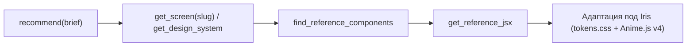

# NeuroAsist (Iris) — Инструкции для агентов разработки

Этот файл содержит ключевые архитектурные директивы, правила UI/UX и руководство по использованию внешних инструментов (включая Inspo MCP).

---

## 1. Базовые правила и дизайн-система проекта

1. **Анимации**:
   - Для всех UI-анимаций в этом проекте **всегда** используй **Anime.js v4** (см. `rules.md`).
2. **Дизайн-система Iris**:
   - Интерфейс — спокойный графитовый рабочий стол (`design.md`, `tokens.css`).
   - Базовый фон: нейтральный графит `oklch(22% 0.008 265)`, основной текст: `#ECEEF3`, фирменный акцент: `#695B86`.
   - Крупные цельные плоскости, иерархия через отступы и мягкие нейтральные тени (никаких цветных неоновых свечений, если это не запрошено явно).
   - Стек UI: React / Vite / Tailwind CSS v4 / Lucide Icons / Anime.js v4.
   - Источник истины для стилей — `apps/web/src/tokens.css` и `design.md`.

---

## 2. Руководство по Inspo MCP (`inspo`)

В окружении подключен MCP-сервер **Inspo** — кураторский архив скриншотов, дизайн-систем, типографики, макроструктур и эталонных JSX-компонентов реальных продакшен-продуктов.

### Когда использовать Inspo:
- **Проектирование новых страниц и разделов**: создание лэндингов, экранов дашборда, настроек, диалогов, профилей, секций.
- **Редизайн или улучшение верстки**: поиск более выразительных макроструктур (bento-grid, stat-led, split-studio, long-document и т.д.).
- **Поиск референсов по стилю**: когда пользователь запрашивает определенный вайб или стиль (dark SaaS, editorial, minimal, brutalism).
- **Быстрый старт компонентов**: получение проверенных эталонных JSX-архетипов (`get_reference_jsx`) для hero, pricing, cta, nav, footer, stats, faq.

### Когда НЕ использовать Inspo:
- В проекте уже есть готовый устоявшийся компонент/паттерн — всегда приоритет у локального кода Iris (`design.md`, `tokens.css`).
- Изменение чисто логическое, бэкендовое (FastAPI/Python), тестовое или инфраструктурное (Docker).
- Пользователь предоставил точные макеты или зафиксировал специфический дизайн.
- *Правило конфликта:* если рекомендации Inspo расходятся с правилами Iris, **побеждают правила Iris**.

---

### Оптимальный рабочий процесс (Workflow & Token Budget)

Не трать контекст на бесконечные поиски. Стандартный цикл исследования занимает 2–4 вызова:

1. **Старт с брифа**:
   Вызови `recommend` с кратким описанием задачи на английском (например: `brief: "dark graphite developer desktop app dashboard"`, `mode: "dark"`).
   Инструмент вернет:
   - выбор подходящей макроструктуры;
   - 5 реальных сайтов-образцов;
   - рекомендуемые компоненты;
   - цветовую гамму.
2. **Точечный поиск (при необходимости)**:
   - `search_screens` — фильтрация по стилю (`minimalism`, `dark-mode`, `editorial`), индустрии или ключевым словам.
   - `find_components` — поиск сайтов с конкретным типом блока (`hero`, `pricing`, `features`, `cta`, `nav`, `footer`, `faq`, `stat`).
3. **Глубокий анализ (2–3 экрана)**:
   - `get_screen(slug)` — детальный разбор структуры секций (fold autopsy), шрифтов и палитры.
   - `get_design_system(slug)` — полный `DESIGN.md` сайта с токенами и CSS-переменными.
4. **Получение эталонного JSX кода**:
   - `find_reference_components(type="hero")` — просмотр доступных архетипов.
   - `get_reference_jsx(type="hero", id="...")` — извлечение готового исходного кода компонента.
5. **Адаптация**:
   - Переведи полученный JSX на цветовую гамму и токены Iris (`tokens.css`).
   - Навесь анимации переходов и микровзаимодействий через **Anime.js v4**.

---

### Справочник инструментов Inspo

| Категория | Инструмент | Параметры и применение |
| :--- | :--- | :--- |
| **Оркестрация** | `recommend` | `brief` (string, обязателен), `macrostructure`, `mode` (`light`/`dark`), `vibe`, `pageType`. Главная точка входа. |
| **Поиск экранов** | `search_screens` | `query`, `style`, `industry`, `macrostructure`, `mode`, `color`. Поиск по архиву скриншотов. |
| | `find_similar` | `slug` (обязателен). Находит похожие экраны по векторным эмбеддингам дизайна. |
| | `find_by_color` | `hex` (обязателен). Поиск сайтов с палитрой, близкой к заданному цвету в OKLAB. |
| | `find_examples_for_macrostructure` | `macrostructure` (обязателен). Примеры сайтов для выбранной сетки/структуры. |
| **Детали экрана** | `get_screen` | `slug` (обязателен), `detail` (`concise`/`standard`/`full`). Разбор структуры и метаданных. |
| | `get_design_system` | `slug` (обязателен). Извлекает `DESIGN.md` конкретного сайта. |
| | `compare` | `slugs` (массив из 2–4 slug). Сравнительный анализ палитр, сеток и компонентов. |
| | `get_site_pages` | `siteSlug` или `screenSlug`. Просмотр связанного пути страниц (flow) сайта. |
| **Компоненты** | `find_components` | `type` (`hero`, `pricing`, `features`, `cta`, `nav`, `footer`, `testimonial`, `logo-cloud`, `faq`, `stat`). Реальные примеры блоков. |
| | `find_reference_components` | `type`, `macro`. Каталог канонических архетипов компонентов. |
| | `get_reference_jsx` | `type`, `id` (обязательны). Возвращает полный готовый JSX код компонента. |
| **Коллекции** | `list_collections` | Просмотр тематических подборок от редакторов. |
| | `get_collection` | `slug` (обязателен). Экраны внутри выбранной редакторской подборки. |
| **Справочники** | `get_filters` | Возвращает все допустимые значения стилей, индустрий, макроструктур и вайбов. |
