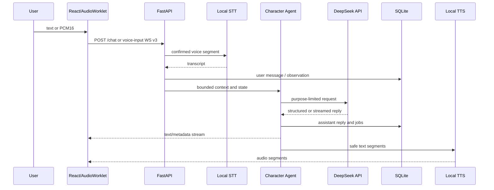

# Архитектура Iris 1.0

## Границы приложения

Iris состоит из четырёх runtime-компонентов:

| Компонент | Владелец | Ответственность |
| --- | --- | --- |
| Tauri shell | `apps/desktop` | Окно, tray, single instance, запуск/остановка core и Unity, Credential Manager, случайный loopback port/token |
| React UI | `apps/web` | Chat, Journal, Memory, Coding Agent, Settings, events, AudioWorklet и playback |
| FastAPI core | `apps/backend` | Conversation orchestration, LLM, STT/TTS, storage, memory, models, diagnostics и WebSocket contracts |
| Unity renderer | `apps/avatar-unity` | VRM, emotion/gesture playback, lip sync и overlay/in-app presentation |

В desktop-режиме Tauri является владельцем lifecycle. Backend не слушает
внешний интерфейс: shell выбирает случайный `127.0.0.1` port и передаёт
короткоживущий token React и Unity. Browser-only development на фиксированном
порту остаётся отдельным режимом.

## Основной поток диалога

Text and voice share Character Agent, context, persistence and memory. Voice
adds VAD, Smart Turn, generation leases and cancellation. Reconnect invalidates
the old lease so late STT/LLM/TTS work cannot publish into a new connection.

## Conversation and character

- `app/agents/character` owns prompts, structured response validation and LLM calls.
- `app/context` builds bounded context from identity, summaries, recent turns and retrieved memories.
- `app/conversation` owns observations, response decisions, mood, relationship state, reflections and live playback state.
- Character Protocol v3 in `apps/protocol` is shared with React and Unity.

Dynamic state is a separate system message so stable prompt prefixes remain
cacheable. Non-coding DeepSeek calls explicitly disable model thinking and use
purpose-specific output/retry budgets. Physical attempts emit content-free
usage telemetry under `/debug/llm/usage`.

## Storage and background work

SQLite is canonical. `TimelineStore` contains timeline messages, episodes,
summaries, memory records/audit, background jobs, character state and Coding
Agent task records. Runtime JSON settings are the only separate mutable user
state; they use atomic replace and transactional publication.

The following durable workers are supervised by the application lifespan:

- episode summary;
- semantic index synchronization;
- memory consolidation;
- reflection;
- Coding Agent task execution.

An unexpected worker exit produces `backend.worker_failed` and restarts with
bounded exponential backoff. Shutdown cancels and awaits supervisors before
closing their dependencies. Blocking SQLite and filesystem work in interactive
async paths runs through the worker thread pool.

## Memory

Memory extraction is not on the visible response critical path. Eligible user
turns are coalesced into a trailing consolidation window; explicit remember,
correction and goodbye cues can schedule immediately. The extraction request
has a hard size budget and sees user deltas plus a small relevant topic
shortlist, not an unbounded conversation or the whole topic catalog.

SQLite stores canonical records, provenance and audit. FTS is the safe
baseline; the optional vector index is rebuildable from SQLite. Deleting an
index never deletes canonical memory.

## Voice

- Browser AudioWorklet emits PCM16 to `/ws/voice-input/{session_id}?version=3`.
- Silero VAD is primary; energy VAD is a controlled fallback.
- Smart Turn distinguishes a pause from a complete utterance.
- Barge-in cancels only the active generation for the session.
- TeraTTSv2 produces local audio segments; playback acknowledgement drives character state.
- Raw microphone audio is RAM-only unless diagnostic capture is explicitly enabled.

The older `/ws/voice/{session_id}?version=1` channel remains the response-audio
transport. There is no supported `/voice/chat` endpoint.

## Coding Agent

Coding Agent is an optional subsystem with a separate purpose profile. A task
uses an isolated workspace and a Docker container with no network, dropped
capabilities, resource limits and no live source mount. Application to an
approved source project requires an explicit user action and source-hash
conflict check. See [Coding Agent](coding-agent.md).

## Failure boundaries

- LLM/TTS failure cannot erase a persisted user turn.
- TTS failure leaves the text response usable.
- Semantic retrieval failure falls back to canonical text retrieval.
- Invalid settings never mutate live state before durable persistence.
- Stale voice work cannot publish after reconnect or shutdown.
- Coding commands never fall back from Docker to the host.

Operational handling and verification commands are in [Operations](operations.md).
