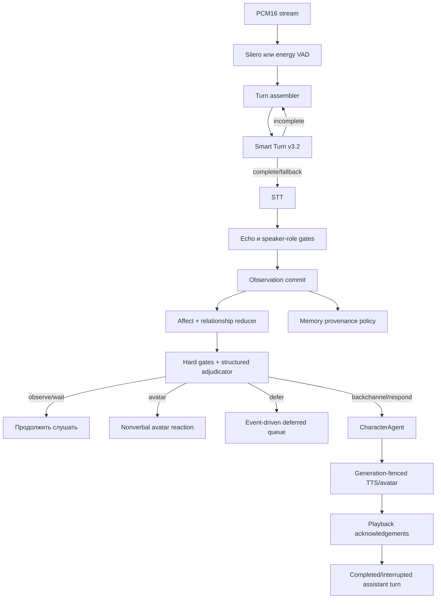

# Iris Live Conversation

## Назначение

Live Conversation — единственный голосовой режим Iris. Текстовый чат сохраняется,
а голос запускается одной кнопкой `Live`: после старта браузер непрерывно
передаёт PCM16, backend сам определяет реплики и автоматически запускает ответ.
Отдельных режимов записи и ручного управления репликой в контракте больше нет.

Параметр `live_conversation_enabled` сохранён только для миграции старых
настроек и всегда считается включённым. Web-клиент использует только
`/ws/voice-input/{session_id}?version=3`.

## Поток данных



## State machine

Сессия проходит фазы:

```text
idle → listening → endpoint_pending → transcribing → deciding
     → generating → speaking → listening
```

`suspended` и `closed` используются для остановленной и закрытой сессии.
Каждый подтверждённый speech start увеличивает `generation`. Результаты STT,
decision и playback acknowledgement старого поколения не могут выполнить
поздний commit.

При barge-in:

1. локальный плеер останавливается до сетевого round-trip;
2. backend увеличивает generation;
3. активные response/TTS/avatar задачи отменяются;
4. старые TTS segments блокируются active-context fence;
5. в timeline сохраняется только подтверждённый playback prefix со статусом
   `interrupted`.

## Turn detection

Model Manager содержит pinned-модель:

```text
id: smart-turn-v3.2
revision: f766f81d3cfdf7737ac64aad813d91bbfd56bf93
file: smart-turn-v3.2-cpu.onnx
sha256: 2bb026316b14a660486a75b1733cd3fbab8c2fd0314dc9af7be49f8cca967e4f
size: 8,679,182 bytes
license: BSD-2-Clause
```

VAD считает endpoint только после непрерывной тишины: тихий, но всё ещё
речевой фрейм сбрасывает pending-паузу. Для профиля `natural` минимум составляет
750 мс со Smart Turn и 1100 мс без него; `short` и `patient` меняют эти границы
вместе с timeout ожидания продолжения. Это предотвращает ранний STT на
внутрифразовой паузе, а Smart Turn затем отдельно решает, завершена ли реплика.

Модель принимает последние восемь секунд 16 kHz PCM. При отсутствии модели,
неподдерживаемой частоте, timeout или ошибке ONNX используется консервативный
audio fallback. PCM продолжает поступать во время inference и STT; продолжение
речи инвалидирует устаревший результат.

Whisper-compatible `80×800` log-mel frontend реализован локально на NumPy.
Smart Turn не импортирует `transformers`, поэтому его зависимости не могут
сломать Chatterbox/Silero TTS. Синтетические fixtures находятся в
`tests/fixtures/live_audio`; manifest содержит transcript, sample rate,
ожидаемый endpoint и назначение записи. Перегенерация:

```powershell
.\.venv\Scripts\python.exe scripts/generate_live_audio_fixtures.py
```

## Observation и память

Порядок live-turn фиксирован:

1. raw transcript сохраняется как completed user message;
2. безопасная интерпретация может храниться отдельно в `corrected_content`;
3. speaker/address/EOT/STT/echo provenance записывается в metadata и
   `conversation_observations`;
4. применяются bounded affect/relationship deltas;
5. eligible primary-speaker observation планирует memory extraction;
6. conversation policy выбирает действие.

`assistant_echo`, `other`, `unknown`, сомнительный STT и incognito не создают
active memory автоматически. Human observation не зависит от успешного ответа
Iris.

## Affect и отношения

Snapshot хранит только ограниченное состояние, а не факты. Все значения
валидируются reducer-ом. Обычный relationship event ограничен `0.03`, серьёзный
подтверждённый — `0.10`, дневной бюджет одного facet — `0.15`. Повторения
ослабляются экспоненциально.

Эмоции затухают по реальному времени с индивидуальными half-life. Настройка
recovery меняет общий множитель:

```text
fast=0.6
natural=1.0
slow=1.6
```

После restart snapshot загружается, к нему применяется offline decay; deferred
tasks и незавершённые generations не восстанавливаются.

## Schema v6

Миграция добавляет:

- `character_state_snapshots`;
- `character_state_events`;
- `character_participant_states`;
- `conversation_observations`.

Перед миграцией существующей БД startup создаёт backup. Миграция идемпотентна и
не меняет существующие memory/timeline rows. Новые таблицы можно оставить на
месте: «Очистить память» их не удаляет, а «Сбросить данные Iris» удаляет.

## WebSocket v3

Conversation events содержат `session_id`, `generation`, `turn_id`,
`utterance_id` и `created_at`:

```text
conversation.phase
conversation.turn_candidate
conversation.turn_completed
conversation.observation
conversation.decision
conversation.silent
conversation.reaction
conversation.deferred
conversation.state
conversation.cancelled
conversation.echo_rejected
```

`voice.input.transcript` содержит `raw_transcript`, исправленный `transcript`,
`confidence`, а при срабатывании вторичной модели — `fallback` и
`fallback_reason`. Silence отображается коротким статусом и не создаёт
assistant bubble.

Клиентский input-контракт:

```text
voice.input.start { protocol_version: 3, sample_rate, language, capture: "live" }
<непрерывные бинарные PCM16-фреймы>
voice.input.stop
```

Поле `mode` и версии протокола 1/2 отклоняются. `stop` завершает всю live-сессию,
а не отдельную реплику. При reconnect старое соединение теряет право принимать
PCM и закрывать сессию; ожидающие фреймы отправляются только новым соединением.

Клиент отправляет:

```text
playback.segment.started
playback.segment.finished
playback.finished
```

Assistant message создаётся только из подтверждённых сегментов.

## Диагностика

Для локальной разработки:

```env
CONVERSATION_DIAGNOSTICS_ENABLED=true
```

После этого `GET /conversation/debug/{session_id}` показывает фазу, generation,
последние observations/decision, affect, participant facets, budgets, active
tasks с generation/reason, speaker estimate, источник decision, deferred queue,
последнюю отмену и состояние turn detector. В dev web-build этот snapshot
показывается в сворачиваемом inspector. Raw audio, prompts и chain-of-thought
endpoint не возвращает.

## Decision, роли и инициатива

Echo, incomplete turn, direct address, explicit invitation, speaker gate,
cooldown и speech budget проверяются локально. Прямое обращение не вызывает
decision LLM. Для неоднозначного primary observation используется единый
decision+appraisal JSON: timeout 1,5 секунды, одна repair-попытка до 1 секунды,
после чего применяется deterministic fallback.

Speaker-role estimator не использует биометрию. В `one_to_one` действует prior
`primary`; в `group` базовый результат `unknown`, а повышение confidence
возможно по прямому обращению, continuity и явным текстовым признакам разговора
с третьим лицом. Reasons доступны в diagnostics.

Deferred queue ограничена тремя элементами, TTL 45 секунд и одной попыткой.
Любая новая human generation отменяет очередь. Инициатива запускается только
наличием deferred event, проверяет тишину, 90-секундный cooldown, максимум две
инициативы за 10 минут и 35% подтверждённой речи Iris в окне две минуты.

## Failure modes

- Smart Turn не установлен: VAD использует более терпеливую fallback-паузу.
- Smart Turn timeout/error: endpoint остаётся pending и закрывается только
  осторожным timeout-fallback, поэтому внутренняя пауза не запускает ранний
  ответ.
- Secondary STT не установлен или упал: первичный результат сохраняется, а
  причина fallback попадает в diagnostics без потери пользовательской реплики.
- STT старого generation: результат отбрасывается до timeline write.
- Decision path не зависит от внешнего adjudicator: hard gates и deterministic
  score работают локально, поэтому прямое обращение не теряется при сбое LLM
  ответа.
- TTS/LLM cancellation: неподтверждённый хвост не попадает в timeline.
- Echo ambiguity: `auto` использует playback window и transcript similarity;
  `half_duplex` полностью отклоняет commit во время активного playback.
- Incognito: timeline, observations, participant events и snapshots остаются
  только в RAM.

## Проверка

Основные команды:

```powershell
.\.venv\Scripts\python.exe -m pytest tests -vv --disable-warnings
npm --prefix apps/web test -- --run
npm run build
```

Короткий soak:

```powershell
.\.venv\Scripts\python.exe scripts/live_conversation_soak.py --duration 900 --cycles 100
```

Четырёхчасовой release soak:

```powershell
.\.venv\Scripts\python.exe scripts/live_conversation_soak.py --full --cycles 100 --output output/live-soak-4h.json
```

Обе команды создают JSON и Markdown report. Синтетические fixtures и soak не
заменяют ручную проверку конкретного микрофона, колонок, браузерного AEC и
акустики помещения.
