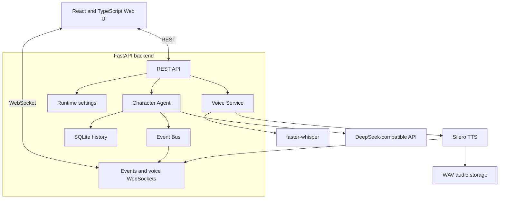

<div align="center">

# NeuroAsist

### Local-first voice AI character and future neuro‑VTuber platform

[](https://github.com/bad1and/NeuroAsist/tree/v0.3.1)
[](https://www.python.org/)
[](https://nodejs.org/)
[](https://fastapi.tiangolo.com/)
[](https://react.dev/)
[](LICENSE)

**English** · [Русская версия](README.ru.md) · [Project Blueprint](Docs/neuro_vtuber_assistant_blueprint_v1.1.md)

</div>

> [!IMPORTANT]
> **NeuroAsist v0.3.1 is an experimental local prototype.**  
> Text chat, push-to-talk, local speech recognition, local speech synthesis, and live voice playback are already implemented. Avatar rendering, lip sync, desktop access, and the development agent are planned for future versions.

## About the project

NeuroAsist is a local control panel and backend for an AI character that can hear the user, understand a request, generate a response, and speak it aloud.

The current release focuses on a stable voice interaction loop:


The long-term goal is to turn this foundation into a modular neuro‑VTuber platform with an animated avatar, emotions, memory, controlled tools, and a sandboxed development agent.

## Current capabilities

| Capability | Status | Implementation |
|---|:---:|---|
| Text conversation | ✅ | FastAPI chat endpoint |
| Push-to-talk voice chat | ✅ | Browser `MediaRecorder` |
| Live voice response | ✅ | WebSocket audio segments |
| Local speech-to-text | ✅ | `faster-whisper` |
| Local Russian text-to-speech | ✅ | Silero `v5_5_ru` |
| Conversation history | ✅ | SQLite |
| Runtime events | ✅ | REST and WebSocket |
| Voice and runtime settings | ✅ | Local React control panel |
| Browser speech fallback | ✅ | Used when backend TTS fails |
| Avatar and lip sync | 🧭 | Planned |
| Development agent and sandbox | 🧭 | Planned |
| Screen and desktop context | 🧭 | Planned |

## Key ideas

- **Local-first voice processing** — STT and TTS run on the user's machine.
- **Fast text response** — the text reply can be returned before background TTS finishes.
- **Fail-soft audio** — a TTS failure does not destroy a successful text response.
- **Observable runtime** — backend, chat, STT, TTS, and WebSocket events are visible in the UI.
- **Modular structure** — LLM, STT, TTS, storage, events, and agents are separated by responsibility.
- **Restricted current scope** — v0.3.1 cannot execute commands, browse files, or control the desktop.

## Interface

The React control panel contains three main sections:

- **Chat** — text messages, microphone recording, transcription, AI replies, and audio playback.
- **Events** — live backend, LLM, STT, TTS, and connection events.
- **Settings** — voice language, Silero speaker, playback speed, live prebuffer, and runtime options.

The header displays backend status, WebSocket connection state, API-key availability, and the fixed LLM model.

## Technology stack

### Backend

- Python 3.12+
- FastAPI
- Pydantic Settings
- SQLite
- WebSocket
- `faster-whisper`
- Silero TTS
- DeepSeek-compatible LLM API

### Frontend

- React 19
- TypeScript
- Vite
- Vitest
- Browser MediaRecorder
- Web Audio API

## Quick start

### Requirements

- Windows 10/11 is the primary development platform;
- Python **3.12+**;
- Node.js **24+**;
- FFmpeg and FFprobe available through `PATH`;
- a DeepSeek API key;
- internet access for the first Whisper and Silero model download;
- optional CUDA-capable GPU.

### 1. Clone the release branch

```powershell
git clone --branch v0.3.1 --single-branch https://github.com/bad1and/NeuroAsist.git
cd NeuroAsist
```

### 2. Create a Python environment

```powershell
python -m venv .venv
.\.venv\Scripts\Activate.ps1
python -m pip install --upgrade pip
python -m pip install -r requirements.txt
```

Install PyTorch separately. The CPU build is the most portable option:

```powershell
python -m pip install torch --index-url https://download.pytorch.org/whl/cpu
python -m pip install silero
```

For CUDA, install the PyTorch build matching the installed GPU driver and CUDA runtime.

### 3. Install frontend dependencies

```powershell
npm install
npm install --prefix apps/web
```

### 4. Configure the environment

```powershell
Copy-Item .env.example .env
```

Set at least:

```env
DEEPSEEK_API_KEY=your_deepseek_api_key
```

Default voice configuration:

```env
VOICE_STT_PROVIDER=faster_whisper
VOICE_STT_MODEL=small
VOICE_STT_DEVICE=auto
VOICE_STT_COMPUTE_TYPE=int8

VOICE_TTS_ENABLED=true
VOICE_TTS_PROVIDER=silero
VOICE_PRELOAD_TTS_MODEL=true
VOICE_SILERO_MODEL=v5_5_ru
VOICE_SILERO_SPEAKER_RU=xenia
VOICE_SILERO_SAMPLE_RATE=24000
VOICE_SILERO_DEVICE=cpu
VOICE_SILERO_CPU_THREADS=4
VOICE_SILERO_WARMUP=true
```

### Environment variable reference

`.env` is read when the backend starts. If you change `.env`, restart the backend. Settings changed in the UI are runtime-only and are reset after backend restart.

#### Core backend

| Variable | What it controls |
|---|---|
| `DEEPSEEK_API_KEY` | DeepSeek-compatible API key. Required for real LLM replies. |
| `DEEPSEEK_BASE_URL` | Base URL for the DeepSeek-compatible API. |
| `DEEPSEEK_MODEL` | Fixed LLM model used by backend routes. The UI does not change it at runtime. |
| `SQLITE_PATH` | Path to the SQLite database with sessions and chat history. |
| `CHAT_HISTORY_LIMIT` | Number of recent messages passed back into the chat context. |
| `LOG_LEVEL` | Backend logging verbosity, for example `DEBUG`, `INFO`, `WARNING`, `ERROR`. |
| `LOG_TO_FILE` | Enables writing backend logs to a file. |
| `LOG_FILE_PATH` | Log file path used when `LOG_TO_FILE=true`. |
| `CORS_ORIGINS` | Comma-separated list of allowed frontend origins. |
| `CORS_ORIGIN_REGEX` | Regex for allowed local development origins. |

#### Speech-to-text

| Variable | What it controls |
|---|---|
| `VOICE_STT_PROVIDER` | STT provider. Use `faster_whisper` for real local recognition; `mock` is for tests. |
| `VOICE_STT_MODEL` | Whisper model size, for example `small`. Larger models can improve quality but need more resources. |
| `VOICE_STT_DEVICE` | STT device policy: `cpu`, `cuda`, or `auto`. |
| `VOICE_STT_COMPUTE_TYPE` | faster-whisper compute type, for example `int8` for CPU-friendly inference. |
| `VOICE_DEFAULT_LANGUAGE` | Default language hint for STT and voice UI, for example `ru`. |
| `VOICE_PRELOAD_STT_MODEL` | Loads the STT model during backend startup instead of on first recording. |
| `VOICE_STT_TIMEOUT_SECONDS` | Maximum time allowed for one STT request. |
| `VOICE_MAX_UPLOAD_MB` | Maximum uploaded audio size. |
| `VOICE_MAX_RECORD_SECONDS` | Maximum accepted recording duration. |

#### Text-to-speech / Silero

| Variable | What it controls |
|---|---|
| `VOICE_TTS_ENABLED` | Enables backend TTS generation. If disabled or failed, the frontend can fall back to browser SpeechSynthesis. |
| `VOICE_TTS_PROVIDER` | Backend TTS provider. Production value is `silero`; `mock` is only for tests. Edge TTS is not supported. |
| `VOICE_PRELOAD_TTS_MODEL` | Loads and warms up Silero during backend startup. First startup can take longer. |
| `VOICE_SILERO_MODEL` | Silero model name. Current default is `v5_5_ru`. |
| `VOICE_SILERO_SPEAKER_RU` | Default Russian Silero speaker, for example `xenia`. Can be changed at runtime from Settings. |
| `VOICE_SILERO_SAMPLE_RATE` | WAV sample rate produced by Silero. Current default is `24000`; changing it requires backend restart. |
| `VOICE_SILERO_DEVICE` | Silero device policy: `cpu`, `cuda`, or `auto`. |
| `VOICE_SILERO_CPU_THREADS` | Number of CPU threads used by PyTorch for Silero inference. |
| `VOICE_SILERO_WARMUP` | Runs a short warmup phrase after loading Silero to reduce first real TTS latency. |
| `VOICE_SILERO_TIMEOUT_SECONDS` | Timeout for synthesizing one phrase. |
| `VOICE_TTS_BACKGROUND_TIMEOUT_SECONDS` | Timeout for background batch TTS jobs created by `/voice/chat`. |
| `VOICE_TTS_TIMEOUT_SECONDS` | General TTS timeout used by voice API flows. |
| `VOICE_TTS_MAX_CHARS` | Maximum text length accepted for one backend TTS request. |
| `VOICE_AUDIO_DIR` | Directory where generated audio files are stored. |

#### Live voice playback

| Variable | What it controls |
|---|---|
| `VOICE_LIVE_QUEUE_SIZE` | Internal live-response queue size. |
| `VOICE_LIVE_IDLE_FLUSH_MS` | Flush delay for the last partial live segment. |
| `VOICE_LIVE_FIRST_SEGMENT_CHARS` | Target size for the first live TTS segment. |
| `VOICE_LIVE_NEXT_SEGMENT_CHARS` | Target size for following live TTS segments. |
| `VOICE_LIVE_MAX_SEGMENT_CHARS` | Hard character limit for one live TTS segment. |
| `VOICE_LIVE_MAX_SEGMENT_WORDS` | Hard word limit for one live TTS segment. |
| `VOICE_LIVE_SAFE_SEGMENT_WORDS` | Preferred word count before the segmenter starts looking for a natural split. |
| `VOICE_LIVE_TTS_RETRY_COUNT` | Number of retries for a failed live TTS segment. |
| `VOICE_LIVE_TTS_CONCURRENCY_MODE` | Live TTS concurrency mode. Default `1` keeps segment order simple and stable. |
| `VOICE_LIVE_TTS_CONCURRENCY_MIN` | Lower live TTS concurrency bound. |
| `VOICE_LIVE_TTS_CONCURRENCY_MAX` | Upper live TTS concurrency bound. |
| `VOICE_LIVE_PLAYBACK_PREBUFFER_SEGMENTS` | Number of decoded live audio segments buffered before playback starts. Runtime-editable in Settings. |
| `VOICE_LIVE_PLAYBACK_PREBUFFER_MS` | Additional live playback prebuffer delay in milliseconds. Runtime-editable in Settings. |

#### Frontend

| Variable | What it controls |
|---|---|
| `VITE_API_BASE_URL` | Backend HTTP base URL used by the React app. |
| `VITE_WS_EVENTS_URL` | Backend WebSocket URL used for events and live voice. |

### 5. Verify FFmpeg

```powershell
ffmpeg -version
ffprobe -version
```

If Windows cannot find FFmpeg in the current terminal:

```powershell
$env:Path = "C:\Path\To\ffmpeg\bin;$env:Path"
```

### 6. Start the backend

```powershell
.\.venv\Scripts\Activate.ps1
python -m uvicorn main:app --host 127.0.0.1 --port 8000 --reload
```

### 7. Start the frontend

Open a second terminal:

```powershell
npm --prefix apps/web run dev
```

Open:

- Web UI: `http://127.0.0.1:5173`
- OpenAPI: `http://127.0.0.1:8000/docs`
- Health check: `http://127.0.0.1:8000/health`

## Architecture



The backend is a modular monolith: API routes, agents, voice providers, runtime settings, events, and storage live in one Python application, while the web interface is a separate Vite application.

This keeps the prototype easy to run and debug without introducing unnecessary infrastructure.

## Voice pipeline

### Standard push-to-talk

```text
Browser MediaRecorder
  → POST /voice/chat
  → faster-whisper
  → Character Agent
  → DeepSeek-compatible LLM
  → immediate text response
  → background Silero synthesis
  → ready WAV audio
```

The text response is returned before TTS finishes. The UI then receives the generated audio when it becomes ready.

### Live voice response

```text
LLM text stream
  → safe text chunks
  → Silero WAV segments
  → voice WebSocket
  → browser playback queue
```

The live mode uses configurable chunk sizes, queue limits, TTS concurrency, and playback prebuffering.

## Project structure

```text
NeuroAsist/
├── apps/
│   ├── backend/
│   │   ├── main.py
│   │   └── app/
│   │       ├── agents/
│   │       ├── api/
│   │       ├── core/
│   │       ├── events/
│   │       ├── llm/
│   │       ├── runtime/
│   │       ├── schemas/
│   │       ├── storage/
│   │       └── voice/
│   └── web/
│       └── src/
├── Docs/
│   └── neuro_vtuber_assistant_blueprint_v1.1.md
├── scripts/
├── tests/
├── main.py
├── requirements.txt
└── package.json
```

## Development commands

Run backend tests:

```powershell
.\.venv\Scripts\python.exe -m pytest
```

Run frontend tests:

```powershell
npm test --prefix apps/web
```

Build the frontend:

```powershell
npm run build
```

Benchmark Silero:

```powershell
python scripts/benchmark_tts.py --provider silero --device cpu --runs 5
python scripts/benchmark_tts.py --provider silero --device cuda --runs 5
```

The benchmark writes results to `data/tts_benchmark.json` and reports P50/P95 synthesis time and real-time factor.

## Troubleshooting

### Silero startup stops at `Using cache found ... snakers4_silero-models_master`

That line is not the final success message. It only means PyTorch Hub found the Silero repository cache. On a fresh or incomplete setup, PyTorch can still download the actual model checkpoint after that line.

If `app.log` contains `CERTIFICATE_VERIFY_FAILED` or `certificate has expired`, the model download failed during HTTPS certificate verification. On the affected Windows machine:

```powershell
# 1. Check Windows date, time, timezone, and run Windows Update for root certificates.

# Optional temporary startup workaround: let the backend start while you fix the
# first Silero download. TTS will retry lazy loading on first use.
$env:VOICE_PRELOAD_TTS_MODEL = "false"

# 2. Update certificate-related Python packages inside the project venv.
.\.venv\Scripts\python.exe -m pip install --upgrade pip certifi requests urllib3

# 3. Point OpenSSL/Python tools at certifi for the current terminal session.
$env:SSL_CERT_FILE = (& .\.venv\Scripts\python.exe -c "import certifi; print(certifi.where())")

# 4. Remove possibly incomplete Torch Hub downloads.
Remove-Item -Recurse -Force "$env:USERPROFILE\.cache\torch\hub\snakers4_silero-models_master" -ErrorAction SilentlyContinue
Remove-Item -Recurse -Force "$env:USERPROFILE\.cache\torch\hub\checkpoints" -ErrorAction SilentlyContinue

# 5. Start the backend again.
.\.venv\Scripts\python.exe -m uvicorn main:app --host 127.0.0.1 --port 8000 --reload
```

If the machine has restricted corporate or antivirus HTTPS inspection, allow Python to access GitHub/PyTorch downloads or prepare the Torch cache on another machine and copy `%USERPROFILE%\.cache\torch` to the target user profile.

### faster-whisper falls back to CPU on Windows

If logs contain:

```text
FasterWhisper CUDA runtime failed, retrying on CPU
```

the NVIDIA driver can see the GPU, but CTranslate2 cannot find the CUDA runtime DLLs needed by `faster-whisper` (`cuBLAS` and `cuDNN`). For a local project-only fix on Windows, download the CUDA 12 library bundle used by faster-whisper and put the DLLs next to the venv Python executable:

```powershell
# 1. Download the CUDA 12 cuBLAS/cuDNN bundle. The archive is large.
New-Item -ItemType Directory -Force -Path .cache\ct2-cuda
Invoke-WebRequest -Uri "https://github.com/Purfview/whisper-standalone-win/releases/download/libs/cuBLAS.and.cuDNN_CUDA12_win_v3.7z" -OutFile ".cache\ct2-cuda\cuBLAS.and.cuDNN_CUDA12_win_v3.7z"

# 2. Download the small standalone 7-Zip extractor.
New-Item -ItemType Directory -Force -Path .cache\7zip
Invoke-WebRequest -Uri "https://www.7-zip.org/a/7za920.zip" -OutFile ".cache\7zip\7za920.zip"
Expand-Archive -Force ".cache\7zip\7za920.zip" ".cache\7zip"

# 3. Verify and extract the CUDA DLL archive.
.\.cache\7zip\7za.exe t .cache\ct2-cuda\cuBLAS.and.cuDNN_CUDA12_win_v3.7z
$out = (Resolve-Path .cache\ct2-cuda).Path + "\extracted"
New-Item -ItemType Directory -Force -Path $out
.\.cache\7zip\7za.exe x .cache\ct2-cuda\cuBLAS.and.cuDNN_CUDA12_win_v3.7z "-o$out" -y

# 4. Make the DLLs visible to the project venv.
Copy-Item -Force .cache\ct2-cuda\extracted\*.dll .venv\Scripts\

# 5. Verify direct faster-whisper CUDA loading.
.\.venv\Scripts\python.exe -c "from faster_whisper import WhisperModel; WhisperModel('small', device='cuda', compute_type='int8_float16'); print('cuda ok')"

# 6. Verify the backend provider chooses CUDA in auto mode.
.\.venv\Scripts\python.exe -c "from apps.backend.app.voice.providers import FasterWhisperSTTProvider; p=FasterWhisperSTTProvider('small','auto','int8'); p._ensure_model(); print('provider ok', p._selected_device, p._selected_compute_type)"
```

Expected result:

```text
cuda ok
provider ok cuda int8_float16
```

With `VOICE_STT_DEVICE=auto`, the backend tries `cuda/int8_float16` first and falls back to `cpu/int8` only if CUDA loading fails. To force GPU mode explicitly:

```env
VOICE_STT_DEVICE=cuda
VOICE_STT_COMPUTE_TYPE=int8_float16
```

## Current limitations

NeuroAsist v0.3.1 does not provide:

- always-on listening;
- automatic voice activity detection conversations;
- interruption while the character is speaking;
- avatar rendering or lip sync;
- long-term semantic memory or RAG;
- file, shell, browser, screen, or desktop access;
- accounts, remote hosting hardening, or multi-user isolation.

## Project documentation

The current project architecture, long-term concept, and development direction are described in:

- **[Neuro‑VTuber Assistant Blueprint v1.1](Docs/neuro_vtuber_assistant_blueprint_v1.1.md)**

## Planned direction

The project is expected to evolve in stages:

1. stable text and voice interaction;
2. VRM or Unity avatar integration;
3. emotions, animations, and lip sync;
4. controlled development agent and project sandbox;
5. screen context and optional long-term memory;
6. modular multi-agent platform.

The exact plan may change as the prototype is tested and developed.

## License

NeuroAsist is licensed under the [Apache License 2.0](LICENSE).

Third-party models and services may have their own licenses and usage terms. Check the selected Silero model license and the configured LLM provider terms before commercial use.
