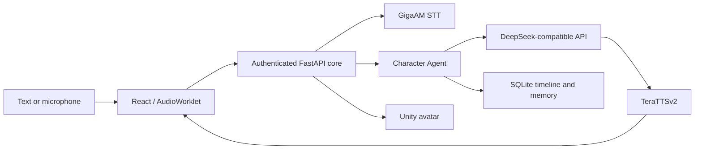

<div align="center">


# Iris

### Local-first voice AI character for Windows

[](VERSION)
[](https://www.python.org/)
[](https://nodejs.org/)
[](https://react.dev/)
[](https://tauri.app/)
[](LICENSE)

**English** · [Русская версия](README.ru.md) · [Documentation](Docs/README.md)

</div>

> [!IMPORTANT]
> The source tree targets **Iris 1.0.0**. The local development application is functional; the distributable installer still has to pass the release checklist before a public release.

Iris is a desktop AI character with local speech recognition and synthesis, a DeepSeek-compatible conversation model, durable memory, a live voice mode, and an optional Unity VRM avatar. The Tauri shell owns the React interface and the authenticated FastAPI core as one application.

## What works

| Area | Current implementation |
| --- | --- |
| Text and live voice | Streaming replies, continuous PCM input, VAD, smart turn detection, barge-in, reconnect cleanup |
| Local speech | GigaAM v3 STT with optional fallback; TeraTTSv2 `ru_f1` voice by default |
| Character | Stable persona, affect, gestures, delivery metadata, mood and relationship state |
| Memory | SQLite as the source of truth, background extraction, provenance, audit, FTS and optional semantic retrieval |
| Desktop | Tauri 2 lifecycle, tray, single instance, safe mode and protected random loopback port |
| Avatar | Optional Unity VRM renderer, lip sync, gestures, desktop overlay or embedded chat placement |
| Coding Agent | Optional Docker-only worker with isolated snapshots, logs, diff and explicit review/apply |
| Diagnostics | Runtime event stream, model/readiness status, token/retry telemetry and backups |

Iris does not provide general desktop control. The Coding Agent can only work inside its task sandbox and never falls back to a host shell.

## Runtime at a glance



See [Architecture](Docs/architecture.md) for ownership and data-flow details.

## Quick start

### Requirements

- Windows 10 or 11;
- Git;
- Python 3.12;
- Node.js 24 and npm 11;
- FFmpeg and FFprobe available through `PATH`;
- a DeepSeek-compatible API key;
- Rust 1.77.2+ and Microsoft C++ Build Tools for Tauri development;
- WebView2 Runtime, normally included with current Windows versions.

Optional components:

- Docker Desktop for Coding Agent;
- Unity 2022.3.62f3 only when rebuilding the avatar renderer;
- an NVIDIA GPU for accelerated STT. The default TTS profile runs on CPU.

### 1. Clone and install

```powershell
git clone https://github.com/bad1and/NeuroAsist.git Iris
cd Iris

python -m venv .venv
.\.venv\Scripts\Activate.ps1
python -m pip install --upgrade pip
python -m pip install -r requirements.txt --extra-index-url https://download.pytorch.org/whl/cu128

npm ci
npm ci --prefix apps/web
npm ci --prefix apps/desktop
```

The repository pins the tested Python and JavaScript dependency graph. If CUDA is not available, install the appropriate PyTorch build for the machine and keep `VOICE_STT_DEVICE=cpu`.

### 2. Configure

```powershell
Copy-Item .env.example .env
```

For browser/backend development, set at least:

```env
DEEPSEEK_API_KEY=your_deepseek_api_key
```

The Tauri first-run screen can store that key in Windows Credential Manager instead. Secrets are not written to runtime settings, backups, or Git. All supported static options and safe defaults are documented inline in [.env.example](.env.example).

### 3. Start the desktop application

```powershell
npm --prefix apps/desktop run dev
```

Tauri starts Vite and the FastAPI core automatically. Use the tray **Quit** action or `Ctrl+C` to stop the managed processes.

### Browser-only development

Run these commands in separate PowerShell windows:

```powershell
.\.venv\Scripts\python.exe -m uvicorn main:app --host 127.0.0.1 --port 8000 --reload
```

```powershell
npm --prefix apps/web run dev
```

Open `http://127.0.0.1:5173`. API documentation is at `http://127.0.0.1:8000/docs`.

## Optional setup

### Coding Agent

```powershell
docker build -t neuroasist-coding -f apps/backend/docker/coding.Dockerfile apps/backend/docker
```

Start Docker Desktop, configure `CODING_API_KEY` if a separate key is desired, then enable the agent in its application section. Read the [Coding Agent safety model](Docs/coding-agent.md) before allowing project context.

### Unity avatar

The checked-in Tauri development flow discovers an existing Unity build automatically. Rebuild it only after Unity-side changes:

```powershell
$env:NEUROASIST_UNITY_EDITOR = 'C:\Program Files\Unity\Hub\Editor\2022.3.62f3\Editor\Unity.exe'
npm --prefix apps/desktop run build:avatar
```

See the [Unity avatar README](apps/avatar-unity/README.md).

## Verification

```powershell
.\.venv\Scripts\python.exe -m pytest -q
npm --prefix apps/web test
npm --prefix apps/web run build
npm --prefix apps/desktop run check
.\.venv\Scripts\python.exe scripts/check_docs.py
```

Operational smoke tests, backups, clean startup and release build commands are in [Operations](Docs/operations.md). The public-release acceptance criteria are in the [1.0 release checklist](Docs/release-checklist.md).

## Data and privacy

- Desktop data is stored under `%LOCALAPPDATA%\NeuroAsist` unless `NEUROASIST_APP_DATA_DIR` overrides it.
- SQLite is canonical for timeline, episodes, memory, settings-related jobs and Coding Agent task records.
- Raw live microphone PCM is not retained by default.
- STT and TTS run locally; conversation prompts and selected compact context are sent to the configured DeepSeek-compatible endpoint.
- Semantic indexes are rebuildable and never replace canonical SQLite data.
- Coding containers have no network, no live project mount and no host-shell fallback.

## Repository map

```text
apps/backend/       FastAPI core, character, memory, voice and storage
apps/web/           React 19 interface
apps/desktop/       Tauri 2 shell and release metadata
apps/avatar-unity/  Optional Unity VRM renderer
apps/protocol/      Shared character and avatar contracts
Docs/               Current architecture, operation and release documents
scripts/            Build, smoke, benchmark and maintenance tools
tests/              Backend regression and isolated experiment suites
```

Start with the [documentation index](Docs/README.md). Historical plans are isolated under [Docs/archive](Docs/archive/README.md) and are not implementation instructions.

Project policies: [Privacy](PRIVACY.md), [Security](SECURITY.md),
[Changelog](CHANGELOG.md), and [Contributing](CONTRIBUTING.md).

## Versioning and releases

`VERSION` is the product-version source of truth. Package manifests mirror it because npm, Cargo and Tauri require their own metadata; `scripts/check_docs.py` verifies that they remain synchronized. The policy is documented in [Versioning](Docs/versioning.md).

The Windows installer build is intentionally a release operation, not the normal development path. Follow [Operations](Docs/operations.md) and complete [the release checklist](Docs/release-checklist.md) before publishing an artifact.

## License

Source code is licensed under [Apache 2.0](LICENSE). Third-party avatar and motion assets have separate terms summarized in [THIRD_PARTY_ASSETS.md](THIRD_PARTY_ASSETS.md).
