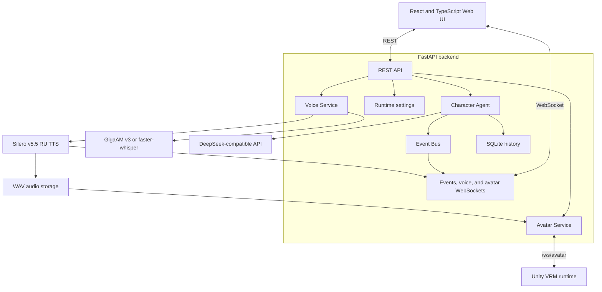

<div align="center">


# Iris

### Local-first voice AI character and future neuro‑VTuber platform

[](https://github.com/bad1and/NeuroAsist/tree/v0.6)
[](https://www.python.org/)
[](https://nodejs.org/)
[](https://fastapi.tiangolo.com/)
[](https://react.dev/)
[](LICENSE)

**English** · [Русская версия](README.ru.md) · [V0.5 Companion Blueprint](Docs/NeuroAsist_V0.5_Companion_Blueprint.md)

</div>

> [!IMPORTANT]
> **Iris v0.6 is an experimental local desktop development branch.**
> The Tauri shell starts the React UI and FastAPI core together. Text and voice chat, long-term memory, and an optional Unity VRM avatar runtime are available.

Iris is the official name. You can also call her **Ирис**, **Айрис**, or **Ириска**.

## About the project

Iris is a local control panel and backend for an AI character that can hear the user, understand a request, generate a response, and speak it aloud.

The current release focuses on a stable voice interaction loop:


The V0.5 direction is a single continuous desktop companion: one character, one shared conversation history, internal episodes, summaries, and controlled long-term memory. It is not a product with user-created chats. Development-agent, sandbox, and desktop-control features are out of V0.5 scope.

## Current capabilities

| Capability | Status | Implementation |
|---|:---:|---|
| Text conversation | ✅ | FastAPI chat endpoint |
| Push-to-talk voice chat | ✅ | Browser `MediaRecorder` |
| Live voice response | ✅ | WebSocket audio segments |
| Audio device selection | ✅ | Choose a microphone and playback device in Voice Settings; selections persist locally |
| Local speech-to-text | ✅ | GigaAM v3, `faster-whisper` fallback |
| Local text-to-speech | ✅ | Silero v5_5_ru, Baya by default |
| Conversation history and journal | ✅ | SQLite timeline, episodes, and summaries |
| Long-term memory | 🧪 | Automatic post-reply extraction, SQLite provenance/audit, policy controls, and Memory Center |
| Semantic memory retrieval | 🧪 | Rebuildable ChromaDB index with SQLite FTS fallback |
| Runtime events | ✅ | REST and WebSocket |
| Voice and runtime settings | ✅ | Local React control panel |
| Browser speech fallback | ✅ | Used when backend TTS fails |
| Unity VRM avatar and lip sync | ✅ | Optional WebSocket client with UniVRM/uLipSync, shown either in the chat or as a desktop overlay |
| Continuous companion runtime | 🧭 | Timeline, episodes, summaries, controlled long-term memory, and the validated Tauri shell are implemented |
| Development agent, sandbox, and desktop control | 🚫 | Explicitly out of V0.5 scope |

## Key ideas

- **Local-first voice processing** — STT and TTS run on the user's machine.
- **Unified live replies** — typed and spoken messages use the same streaming LLM/TTS channel; typed input bypasses STT entirely.
- **Fail-soft audio** — a TTS failure does not destroy a successful text response.
- **Observable runtime** — backend, chat, STT, TTS, and WebSocket events are visible in the UI.
- **Modular structure** — LLM, STT, TTS, storage, events, and agents are separated by responsibility.
- **Restricted current scope** — the companion cannot execute commands, browse files, or control the desktop.

## Interface

The React control panel contains five main sections:

- **Chat** — text messages, microphone recording, transcription, AI replies, audio playback, and a confirmed **New dialog** action that clears the current conversation while preserving long-term memory.
- **Journal** — the continuous timeline and internal conversation episodes.
- **Memory** — saved facts, provenance, review, and a full reset of memory and history.
- **Events** — live backend, LLM, STT, TTS, and connection events.
- **Settings** — voice language, input microphone, output device, TTS voice, playback speed, live prebuffer, runtime options, and avatar test controls.

The header displays backend status, WebSocket connection state, API-key availability, and the fixed LLM model.

## Technology stack

### Backend

- Python 3.12+
- FastAPI
- Pydantic Settings
- SQLite
- WebSocket
- GigaAM v3
- `faster-whisper` as a multilingual fallback
- Silero v5_5_ru with Baya, SSML delivery profiles and Russian normalization
- DeepSeek-compatible LLM API

### Frontend

- React 19
- TypeScript
- Vite
- Vitest
- Browser MediaRecorder
- Web Audio API

## Quick start

### Requirements

- Windows 10/11 is the primary development platform;
- Python **3.12+**;
- Node.js **24+**;
- FFmpeg and FFprobe available through `PATH`;
- a DeepSeek API key;
- internet access for the first GigaAM/Whisper and Silero download;
- optional CUDA-capable GPU.

### 1. Clone the development branch

```powershell
git clone --branch v0.6 --single-branch https://github.com/bad1and/NeuroAsist.git Iris
cd Iris
```

### 2. Create a Python environment

```powershell
python -m venv .venv
.\.venv\Scripts\Activate.ps1
python -m pip install --upgrade pip
python -m pip install -r requirements.txt --extra-index-url https://download.pytorch.org/whl/cu128
.\scripts\install-openvoice.ps1
```

The current lockfile uses the tested CUDA build `torch==2.11.0+cu128`. It requires
an NVIDIA GPU and a compatible driver. Verify the installation with:

```powershell
python -c "import torch; print(torch.cuda.is_available()); print(torch.cuda.get_device_name(0))"
```

The recommended TTS setup runs entirely on CPU and does not reserve GPU VRAM.
`VOICE_STT_DEVICE` can independently be set to `cpu` or `cuda` in `.env`.

### 3. Install frontend dependencies

```powershell
npm install
npm install --prefix apps/web
npm install --prefix apps/desktop
```

### 4. Configure the environment

```powershell
Copy-Item .env.example .env
```

Set at least:

```env
DEEPSEEK_API_KEY=your_deepseek_api_key
```

Default voice configuration:

```env
VOICE_STT_PROVIDER=gigaam
VOICE_STT_MODEL=v3_rnnt
VOICE_STT_DEVICE=cpu

VOICE_TTS_ENABLED=true
VOICE_TTS_PROVIDER=silero
VOICE_PRELOAD_TTS_MODEL=true
VOICE_SILERO_MODEL=v5_5_ru
VOICE_SILERO_SPEAKER_RU=baya
VOICE_SILERO_SAMPLE_RATE=48000
VOICE_SILERO_DEVICE=cpu
VOICE_SILERO_NATIVE_ENGLISH=false
VOICE_STRESS_ENABLED=true
VOICE_STRESS_CPU_THREADS=1
VOICE_TTS_POSTPROCESSING_ENABLED=true
VOICE_TTS_HIGHPASS_CUTOFF_HZ=60
VOICE_TTS_ADAPTIVE_PROSODY=true
VOICE_CMUDICT_ENABLED=true
VOICE_CMUDICT_CACHE_DIR=.cache/cmudict
VOICE_OPENVOICE_ENABLED=false
VOICE_OPENVOICE_REFERENCE_AUDIO=
VOICE_OPENVOICE_CACHE_DIR=.cache/openvoice-v2
```

### Environment variable reference

`.env` is read when the backend starts. If you change `.env`, restart the backend. Settings changed in the UI are runtime-only and are reset after backend restart.

#### Core backend

| Variable | What it controls |
|---|---|
| `DEEPSEEK_API_KEY` | DeepSeek-compatible API key. Required for real LLM replies. |
| `DEEPSEEK_BASE_URL` | Base URL for the DeepSeek-compatible API. |
| `DEEPSEEK_MODEL` | Fixed LLM model used by backend routes. The UI does not change it at runtime. |
| `SQLITE_PATH` | Path to the SQLite database with sessions and chat history. |
| `CHAT_HISTORY_LIMIT` | Number of recent messages passed back into the chat context. |
| `LOG_LEVEL` | Backend logging verbosity, for example `DEBUG`, `INFO`, `WARNING`, `ERROR`. |
| `LOG_TO_FILE` | Enables writing backend logs to a file. |
| `LOG_FILE_PATH` | Log file path used when `LOG_TO_FILE=true`. |
| `CORS_ORIGINS` | Comma-separated list of allowed frontend origins. |
| `CORS_ORIGIN_REGEX` | Regex for allowed local development origins. |

#### Speech-to-text

| Variable | What it controls |
|---|---|
| `VOICE_STT_PROVIDER` | STT provider: `gigaam` for accurate Russian, `faster_whisper` for multilingual use, or `mock` for tests. |
| `VOICE_STT_MODEL` | Provider model: `v3_rnnt` is recommended for GigaAM and `large-v3-turbo` for faster-whisper. |
| `VOICE_STT_DEVICE` | STT device policy: `cpu`, `cuda`, or `auto`. |
| `VOICE_STT_COMPUTE_TYPE` | faster-whisper-only compute type, such as `int8` for CPU or `int8_float16` for CUDA. GigaAM ignores it. |
| `VOICE_DEFAULT_LANGUAGE` | Default language hint for STT and voice UI, for example `ru`. |
| `VOICE_PRELOAD_STT_MODEL` | Loads the STT model during backend startup instead of on first recording. |
| `VOICE_STT_TIMEOUT_SECONDS` | Maximum time allowed for one STT request. |
| `VOICE_MAX_UPLOAD_MB` | Maximum uploaded audio size. |
| `VOICE_MAX_RECORD_SECONDS` | Maximum accepted recording duration. |

For a Russian voice assistant, the recommended setup is `gigaam` + `v3_rnnt`. It is the most word-accurate mode, but returns lowercase text without punctuation. `v3_e2e_rnnt` produces readable punctuation and normalized numbers with a small accuracy trade-off. On a GTX 1660 SUPER / Ryzen 7 5700X control run (`20` short Golos recordings), `v3_rnnt` reached `1.0% WER` with `0.56 s` median latency on GPU or `0.40 s` on CPU with four threads. `large-v3-turbo` reached `16.2% WER` and `1.26 s`; Whisper `small` reached `32.3% WER` and `1.05 s`. This small run selects the runtime; final quality should be checked on the actual user's recordings.

#### Text-to-speech

| Variable | What it controls |
|---|---|
| `VOICE_TTS_ENABLED` | Enables backend TTS generation. If disabled or failed, the frontend can fall back to browser SpeechSynthesis. |
| `VOICE_TTS_PROVIDER` | Backend TTS provider: `silero`; `mock` is only for tests. |
| `VOICE_PRELOAD_TTS_MODEL` | Loads and warms up the selected TTS model during backend startup. First startup downloads local weights and takes longer. |
| `VOICE_OPENVOICE_ENABLED` | Applies CPU-only OpenVoice V2 tone conversion after Silero. Keep disabled for minimum latency. |
| `VOICE_OPENVOICE_REFERENCE_AUDIO` | A clean roughly 5–15 second WAV/MP3 reference. It is read locally once during startup. |
| `VOICE_OPENVOICE_CACHE_DIR` | Project-local directory for the 131 MB converter checkpoint. |
| `VOICE_OPENVOICE_TAU` | Conversion variation; the tested default is `0.3`. |
| `VOICE_OPENVOICE_CPU_THREADS` | CPU threads used by the converter. `8` is recommended for a Ryzen 7 5700X. |
| `VOICE_SILERO_MODEL` | Silero model name. Current default is `v5_5_ru`. |
| `VOICE_SILERO_SPEAKER_RU` | Default Russian Silero speaker, `baya` by default. Can be changed at runtime from Settings. |
| `VOICE_SILERO_SAMPLE_RATE` | WAV sample rate produced by Silero. Default is `48000`; changing it requires backend restart. |
| `VOICE_SILERO_DEVICE` | Silero device policy: `cpu`, `cuda`, or `auto`. |
| `VOICE_SILERO_NATIVE_ENGLISH` | Keep `false` when one consistent voice is required. English is then transcribed into Cyrillic and spoken by the same Russian speaker. |
| `VOICE_CMUDICT_ENABLED` | Uses the official CMU pronunciation dictionary for English-to-Cyrillic transcription. |
| `VOICE_CMUDICT_CACHE_DIR` | Local cache for the approximately 3.6 MB pronunciation dictionary and its license. |
| `VOICE_SILERO_CPU_THREADS` | Number of CPU threads used by PyTorch for Silero inference. |
| `VOICE_SILERO_WARMUP` | Runs a short warmup phrase after loading Silero to reduce first real TTS latency. |
| `VOICE_SILERO_TIMEOUT_SECONDS` | Timeout for synthesizing one phrase. |
| `VOICE_SILERO_LOUDNESS_TARGET_DBFS` / `VOICE_SILERO_PEAK_CEILING_DBFS` | Target speech loudness and hard peak ceiling for generated WAV files. |
| `VOICE_STRESS_ENABLED` | Uses local Silero Stress to add explicit Russian stress before TTS. Loading failures retain v5_5_ru's built-in stress. |
| `VOICE_STRESS_CPU_THREADS` | Requested CPU thread budget for the local accentor; the packaged model defaults to one thread. |
| `VOICE_TTS_POSTPROCESSING_ENABLED` | Enables DC removal, high-pass filtering, anti-click fades, and safe normalization for generated WAV. |
| `VOICE_TTS_HIGHPASS_CUTOFF_HZ` | Low-frequency rumble cutoff used when TTS post-processing is enabled; `60` is the default. |
| `VOICE_TTS_ADAPTIVE_PROSODY` | Adds safe semantic clause pauses while keeping Silero's model-native style intensity. Disable for a strict baseline comparison. |
| `VOICE_SILERO_PRONUNCIATION_DICTIONARY_PATH` | Optional path to a JSON pronunciation dictionary. By default it is created in the app data directory. |
| `VOICE_TTS_BACKGROUND_TIMEOUT_SECONDS` | Timeout for background batch TTS jobs created by `/voice/chat`. |
| `VOICE_TTS_TIMEOUT_SECONDS` | General TTS timeout used by voice API flows. |
| `VOICE_TTS_MAX_CHARS` | Maximum text length accepted for one backend TTS request. |
| `VOICE_AUDIO_DIR` | Directory where generated audio files are stored. Generated WAV files are cleared at backend startup, then every 20 minutes files older than 2 minutes are removed. |

Silero v5.5 RU is the primary local TTS engine. The default voice is `baya` at
48 kHz; `xenia` remains available from the voice selector. Text is normalized
before synthesis, and Silero SSML controls pauses and the active style profile.
The generated WAV is normalized to the configured loudness target and peak
ceiling. The editable pronunciation dictionary is created at
`data/tts-pronunciations.json` on its first use.

#### Live voice playback

| Variable | What it controls |
|---|---|
| `VOICE_LIVE_QUEUE_SIZE` | Internal live-response queue size. |
| `VOICE_LIVE_IDLE_FLUSH_MS` | Flush delay for the last partial live segment. |
| `VOICE_LIVE_FIRST_IDLE_FLUSH_MS` | First speakable-fragment idle flush; default `180` ms. |
| `VOICE_LIVE_NEXT_IDLE_FLUSH_MS` | Following-fragment idle flush; default `350` ms. |
| `VOICE_LIVE_PLAYBACK_START_LEAD_MS` | Browser scheduling lead for backend audio; default `30` ms. |
| `VOICE_LIVE_FIRST_SEGMENT_CHARS` | Target size for the first live TTS segment. |
| `VOICE_LIVE_NEXT_SEGMENT_CHARS` | Target size for following live TTS segments. |
| `VOICE_LIVE_MAX_SEGMENT_CHARS` | Hard character limit for one live TTS segment. |
| `VOICE_LIVE_MAX_SEGMENT_WORDS` | Hard word limit for one live TTS segment. |
| `VOICE_LIVE_SAFE_SEGMENT_WORDS` | Maximum conversational thought kept in one live TTS request before the segmenter seeks a natural split. Default `18` avoids stitched-sounding speech. |
| `VOICE_LIVE_TTS_RETRY_COUNT` | Number of retries for a failed live TTS segment. |
| `VOICE_LIVE_TTS_CONCURRENCY_MODE` | Live TTS concurrency mode. Default `1` keeps segment order simple and stable. |
| `VOICE_LIVE_TTS_CONCURRENCY_MIN` | Lower live TTS concurrency bound. |
| `VOICE_LIVE_TTS_CONCURRENCY_MAX` | Upper live TTS concurrency bound. |
| `VOICE_LIVE_PLAYBACK_PREBUFFER_SEGMENTS` | Number of decoded live audio segments buffered before playback starts. Runtime-editable in Settings. |
| `VOICE_LIVE_PLAYBACK_PREBUFFER_MS` | Additional live playback prebuffer delay in milliseconds. Runtime-editable in Settings. |
| `VOICE_VAD_PROVIDER` | Live PCM input VAD provider: `silero` (with safe energy fallback) or `energy`. |
| `VOICE_SILERO_VAD_MODEL_PATH` | Optional local 16 kHz Silero TorchScript override. If loading fails, packaged `silero-vad==6.2.1` is tried before energy fallback. |
| `VOICE_SILERO_VAD_START_THRESHOLD` / `VOICE_SILERO_VAD_END_THRESHOLD` | Silero streaming start/end probabilities. Defaults: `0.55` / `0.35`. |
| `VOICE_ENERGY_VAD_START_RMS` / `VOICE_ENERGY_VAD_END_RMS` | RMS thresholds used only by explicit/runtime energy fallback. Defaults: `0.018` / `0.012`. |
| `VOICE_VAD_PRE_ROLL_MS` | RAM-only PCM ring-buffer duration preserved before detected speech. Default: `900` ms; lower values are raised to this safe minimum at runtime. |
| `VOICE_VAD_POST_ROLL_MS` | Silence retained after speech. Only this tail, not all endpoint silence, is sent to STT. |
| `VOICE_VAD_END_SILENCE_MS` / `VOICE_VAD_LIVE_END_SILENCE_MS` | Hands-free and SmartTurn-backed live endpoint delays. Defaults: `720` / `750` ms; shorter values are raised to the selected pause profile's safe minimum. |
| `VOICE_VAD_LIVE_FALLBACK_END_SILENCE_MS` | Conservative live delay when SmartTurn is unavailable. Default: `1100` ms. |
| `VOICE_TORCH_CPU_THREADS` / `VOICE_TORCH_INTEROP_THREADS` | Process-wide PyTorch threading, configured before STT/VAD/TTS model loading. Defaults: `4` / `1`. |
| `VOICE_STT_TERMS_PATH` | Optional exact-alias STT dictionary path. Defaults to private app data `stt-terms.json`. |
| `VOICE_INPUT_DIAGNOSTIC_AUDIO` | Persist canonical diagnostic WAV+JSON in the private diagnostics directory. Disabled by default. |

#### Unity avatar bridge

| Variable | What it controls |
|---|---|
| `AVATAR_ENABLED` | Enables delivery of avatar commands to connected Unity clients. Disabled by default, so Unity is optional. |
| `AVATAR_HEARTBEAT_INTERVAL_SECONDS` | Interval between backend heartbeat pings to avatar clients. |
| `AVATAR_CLIENT_TIMEOUT_SECONDS` | Time without a heartbeat after which an avatar client is disconnected. |

#### Frontend

| Variable | What it controls |
|---|---|
| `VITE_API_BASE_URL` | Backend HTTP base URL used by the React app. |
| `VITE_WS_EVENTS_URL` | Backend WebSocket URL used for events and live voice. |

### 5. Verify FFmpeg

```powershell
ffmpeg -version
ffprobe -version
```

If Windows cannot find FFmpeg in the current terminal:

```powershell
$env:Path = "<ffmpeg-bin>;$env:Path"
```

### 6. Start the desktop application (recommended)

```powershell
npm --prefix apps/desktop run dev
```

This one command starts Vite and the local FastAPI core; a separately started backend or browser tab is not required. See the [desktop README](apps/desktop/README.md) for avatar build options.

### 7. Start backend and web UI separately (optional)

```powershell
.\.venv\Scripts\Activate.ps1
python -m uvicorn main:app --host 127.0.0.1 --port 8000 --reload
```

### 8. Start the frontend

Open a second terminal:

```powershell
npm --prefix apps/web run dev
```

Open:

- Web UI: `http://127.0.0.1:5173`
- OpenAPI: `http://127.0.0.1:8000/docs`
- Health check: `http://127.0.0.1:8000/health`

## Architecture



The backend is a modular monolith: API routes, agents, voice providers, runtime settings, events, and storage live in one Python application, while the web interface is a separate Vite application.

This keeps the prototype easy to run and debug without introducing unnecessary infrastructure.

## Voice pipeline

### Standard push-to-talk

```text
Browser MediaRecorder
  → POST /voice/chat
  → GigaAM v3
  → Character Agent
  → DeepSeek-compatible LLM
  → immediate text response
  → background Silero synthesis
  → ready WAV audio
```

When backend TTS is enabled, typed messages use the live WebSocket stream too: text deltas and audio arrive together, without an STT pass. If the live channel is unavailable, the UI falls back to the normal text endpoint and then browser speech when needed.

### Live responses (voice and typed text)

```text
LLM text stream
  → safe text chunks
  → Silero WAV segments
  → voice WebSocket
  → browser playback queue
```

The live mode uses configurable chunk sizes, queue limits, TTS concurrency, and playback prebuffering. Voice input adds STT first; typed input enters the same pipeline directly.

### Barge-in

When the hands-free VAD confirms that the user has started speaking (after its
short anti-noise debounce), playback is stopped locally before any network
round-trip: the live queue, a complete WAV, and browser speech are all muted.
The client then cancels the live utterance; the backend cancels the active LLM/
TTS work, any queued full-WAV synthesis for that session, and sends `avatar.stop`
to Unity. Pressing the push-to-talk button while the assistant is responding
uses the same path before recording begins.

### Unity avatar playback

```text
Chat or non-live voice response
  → background Silero synthesis
  → voice.tts_ready
  → complete WAV URL
  → avatar.speak over /ws/avatar
  → Unity AudioSource, lip sync, and VRM expression
```

The avatar bridge remains optional: unavailable Unity clients do not delay or fail text chat or TTS. The renderer source lives in [`apps/avatar-unity`](apps/avatar-unity/README.md); Tauri launches it with an authenticated dynamic-port WebSocket and exposes controls through the Settings page and tray.

In **Settings → System → Avatar**, choose whether the renderer appears as a separate desktop overlay or **inside Iris**. On Windows, in-app mode presents Unity as a transparent, borderless native surface owned by the Iris window in the lower-left column of the **Dialog** page. It follows the chat layout, DPI, and available window size; it remains proportional on maximized windows, has no Unity title bar, stays out of Alt+Tab, and does not create a second visible application window. The **Show in dialog** switch is stored separately from the visibility of the external overlay, so hiding the latter never suppresses the in-app avatar. Speech, lip sync, expressions, and gestures work identically in both modes.

## Project structure

```text
Iris/
├── apps/
│   ├── backend/
│   │   ├── main.py
│   │   └── app/
│   │       ├── agents/
│   │       ├── avatar/
│   │       ├── api/
│   │       ├── core/
│   │       ├── events/
│   │       ├── llm/
│   │       ├── runtime/
│   │       ├── schemas/
│   │       ├── storage/
│   │       └── voice/
│   └── web/
│       └── src/
├── Docs/
│   ├── NeuroAsist_V0.5_Companion_Blueprint.md
│   ├── milestone-0-freeze.md
│   └── version-manifest-v0.4.1.json
├── scripts/
├── tests/
├── main.py
├── requirements.txt
└── package.json
```

## Development commands

Run backend tests:

```powershell
.\.venv\Scripts\python.exe -m pytest
```

Run frontend tests:

```powershell
npm test --prefix apps/web
```

Build the frontend:

```powershell
npm run build
```

Benchmark Silero:

```powershell
python scripts/benchmark_tts.py --provider silero --device cpu --runs 5
python scripts/benchmark_tts.py --provider silero --device cuda --runs 5
```

The benchmark writes results to `data/tts_benchmark.json` and reports P50/P95 synthesis time and real-time factor.

For STT, open Settings → Voice → “Collect private STT corpus”. The guided
capture uses the same `BrowserVadRecorder`, keeps recordings in browser
IndexedDB, and exports WAV files plus a manifest. Then run:

```powershell
.\.venv\Scripts\python.exe scripts/benchmark_stt.py baseline --manifest path\to\stt-manifest.json --output data\stt-baseline.json --streaming-replay
.\.venv\Scripts\python.exe scripts/benchmark_stt.py candidate --manifest path\to\stt-manifest.json --output data\stt-candidate.json --streaming-replay
.\.venv\Scripts\python.exe scripts/benchmark_stt.py compare --baseline data\stt-baseline.json --candidate data\stt-candidate.json --output data\stt-compare.json
```

Use the `threads` action to benchmark 1/2/4/8 PyTorch threads in isolated
subprocesses. Recordings and diagnostic audio are private and ignored by Git.

## Troubleshooting

### Silero startup stops at `Using cache found ... snakers4_silero-models_master`

That line is not the final success message. It only means PyTorch Hub found the Silero repository cache. On a fresh or incomplete setup, PyTorch can still download the actual model checkpoint after that line.

If `app.log` contains `CERTIFICATE_VERIFY_FAILED` or `certificate has expired`, the model download failed during HTTPS certificate verification. On the affected Windows machine:

```powershell
# 1. Check Windows date, time, timezone, and run Windows Update for root certificates.

# Optional temporary startup workaround: let the backend start while you fix the
# first Silero download. TTS will retry lazy loading on first use.
$env:VOICE_PRELOAD_TTS_MODEL = "false"

# 2. Update certificate-related Python packages inside the project venv.
.\.venv\Scripts\python.exe -m pip install --upgrade pip certifi requests urllib3

# 3. Point OpenSSL/Python tools at certifi for the current terminal session.
$env:SSL_CERT_FILE = (& .\.venv\Scripts\python.exe -c "import certifi; print(certifi.where())")

# 4. Remove possibly incomplete Torch Hub downloads.
Remove-Item -Recurse -Force "$env:USERPROFILE\.cache\torch\hub\snakers4_silero-models_master" -ErrorAction SilentlyContinue
Remove-Item -Recurse -Force "$env:USERPROFILE\.cache\torch\hub\checkpoints" -ErrorAction SilentlyContinue

# 5. Start the backend again.
.\.venv\Scripts\python.exe -m uvicorn main:app --host 127.0.0.1 --port 8000 --reload
```

If the machine has restricted corporate or antivirus HTTPS inspection, allow Python to access GitHub/PyTorch downloads or prepare the Torch cache on another machine and copy `%USERPROFILE%\.cache\torch` to the target user profile.

### GigaAM STT

On first use, GigaAM downloads the roughly `426 MB` `v3_rnnt` checkpoint to `%USERPROFILE%\.cache\gigaam`. CPU is recommended for Russian on the target machine: short utterances were faster on the Ryzen 7 5700X than on the GTX 1660 SUPER, while leaving VRAM free. Verify the installed provider with:

```powershell
.\.venv\Scripts\python.exe -c "import asyncio; from apps.backend.app.voice.providers import GigaAMSTTProvider; p=GigaAMSTTProvider('v3_rnnt','cpu'); asyncio.run(p.preload()); print('gigaam ok', p._selected_device)"
```

`v3_rnnt` is Russian-first. For English or mixed-language speech, switch to:

```env
VOICE_STT_PROVIDER=faster_whisper
VOICE_STT_MODEL=large-v3-turbo
VOICE_STT_DEVICE=cuda
VOICE_STT_COMPUTE_TYPE=int8_float16
```

### faster-whisper falls back to CPU on Windows

If logs contain:

```text
FasterWhisper CUDA runtime failed, retrying on CPU
```

the NVIDIA driver can see the GPU, but CTranslate2 cannot find the CUDA runtime DLLs needed by `faster-whisper` (`cuBLAS` and `cuDNN`). For a local project-only fix on Windows, download the CUDA 12 library bundle used by faster-whisper and put the DLLs next to the venv Python executable:

```powershell
# 1. Download the CUDA 12 cuBLAS/cuDNN bundle. The archive is large.
New-Item -ItemType Directory -Force -Path .cache\ct2-cuda
Invoke-WebRequest -Uri "https://github.com/Purfview/whisper-standalone-win/releases/download/libs/cuBLAS.and.cuDNN_CUDA12_win_v3.7z" -OutFile ".cache\ct2-cuda\cuBLAS.and.cuDNN_CUDA12_win_v3.7z"

# 2. Download the small standalone 7-Zip extractor.
New-Item -ItemType Directory -Force -Path .cache\7zip
Invoke-WebRequest -Uri "https://www.7-zip.org/a/7za920.zip" -OutFile ".cache\7zip\7za920.zip"
Expand-Archive -Force ".cache\7zip\7za920.zip" ".cache\7zip"

# 3. Verify and extract the CUDA DLL archive.
.\.cache\7zip\7za.exe t .cache\ct2-cuda\cuBLAS.and.cuDNN_CUDA12_win_v3.7z
$out = (Resolve-Path .cache\ct2-cuda).Path + "\extracted"
New-Item -ItemType Directory -Force -Path $out
.\.cache\7zip\7za.exe x .cache\ct2-cuda\cuBLAS.and.cuDNN_CUDA12_win_v3.7z "-o$out" -y

# 4. Make the DLLs visible to the project venv.
Copy-Item -Force .cache\ct2-cuda\extracted\*.dll .venv\Scripts\

# 5. Verify direct faster-whisper CUDA loading.
.\.venv\Scripts\python.exe -c "from faster_whisper import WhisperModel; WhisperModel('large-v3-turbo', device='cuda', compute_type='int8_float16'); print('cuda ok')"

# 6. Verify the backend provider chooses CUDA in auto mode.
.\.venv\Scripts\python.exe -c "from apps.backend.app.voice.providers import FasterWhisperSTTProvider; p=FasterWhisperSTTProvider('large-v3-turbo','auto','int8'); p._ensure_model(); print('provider ok', p._selected_device, p._selected_compute_type)"
```

Expected result:

```text
cuda ok
provider ok cuda int8_float16
```

With `VOICE_STT_DEVICE=auto`, the backend tries `cuda/int8_float16` first and falls back to `cpu/int8` only if CUDA loading fails. To force GPU mode explicitly:

```env
VOICE_STT_DEVICE=cuda
VOICE_STT_COMPUTE_TYPE=int8_float16
```

## Current limitations

### V0.7 memory development

SQLite is the source of truth for memories, their message sources, statuses, and
audit history; ChromaDB is a rebuildable semantic index in `data/chroma`.
Before each reply, active memories are retrieved through SQLite FTS and ChromaDB
and supplied as compact context to DeepSeek. After the visible reply, one durable
background `memory_extract` job asks DeepSeek for candidate facts and applies the
same policy checks before writing them. This does not add a second LLM wait to
the user-facing response.

Passwords, codes, tokens, and API keys are removed before the extraction prompt
and can never become memories. A narrow reliable fallback covers stated response
length preference, current goal, and assistant developers; ambiguous social
relations stay in review. Voice STT text receives a conservative interpretation
before it reaches DeepSeek: obvious typos and known names can be repaired while
the raw transcript remains available in the journal. Memory Center is the final user control: records can
be inspected, edited, confirmed, removed, reindexed, or reset together with
history. See [ChromaDB memory](Docs/chroma-memory.md) for configuration and
limitations; the old local-LLM graph proposal is explicitly archived in
[Memory plan](Docs/Memory_plan.md).

The pre-Iris v0.4.0 build does not provide:

- always-on listening;
- Unity live-audio segments (full WAV avatar playback is supported);
- guaranteed high-quality semantic retrieval: the ChromaDB index is in development and currently uses lightweight hash embeddings;
- file, shell, browser, screen, or desktop access;
- accounts, remote hosting hardening, or multi-user isolation.

## Project documentation

The current V0.5 direction and the frozen V0.4.1 baseline are described in:

- **[V0.5 Continuous Companion Blueprint](Docs/NeuroAsist_V0.5_Companion_Blueprint.md)**
- **[Milestone 0 freeze record](Docs/milestone-0-freeze.md)**
- **[Milestone 1 unified timeline](Docs/milestone-1-unified-timeline.md)**
- **[Milestone 2 episode manager](Docs/milestone-2-episode-manager.md)**
- **[Milestone 3 summaries and Context Manager](Docs/milestone-3-context-manager.md)**
- **[Milestone 4 Tauri desktop shell](Docs/milestone-4-desktop-shell.md)**
- **[Milestone 5 long-term memory](Docs/milestone-5-long-term-memory.md)**
- **[Milestone 6 semantic retrieval](Docs/milestone-6-semantic-retrieval.md)**
- **[Unity avatar renderer](apps/avatar-unity/README.md)**

## Planned direction

V0.5 progresses only through the milestones in the companion blueprint: freeze, unified timeline, automatic episodes, summaries/context, desktop shell, long-term memory, semantic retrieval, character protocol, avatar overlay, live voice, packaging, then stabilization. The existing V0.4 runtime remains compatible until the relevant milestone explicitly changes it.

## License

Iris is licensed under the [Apache License 2.0](LICENSE).

Third-party models and services may have their own licenses and usage terms. Check the Silero model and configured LLM provider terms before commercial use.
