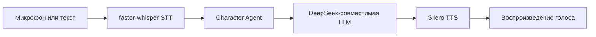
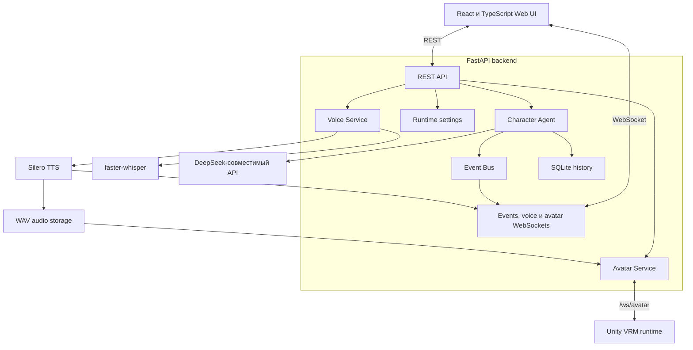

<div align="center">

# NeuroAsist

### Локальный голосовой AI‑персонаж и будущая neuro‑VTuber платформа

[](https://github.com/bad1and/NeuroAsist/tree/v0.4)
[](https://www.python.org/)
[](https://nodejs.org/)
[](https://fastapi.tiangolo.com/)
[](https://react.dev/)
[](LICENSE)

[English](README.md) · **Русский** · [Blueprint проекта](Docs/neuro_vtuber_assistant_blueprint_v1.1.md)

</div>

> [!IMPORTANT]
> **NeuroAsist v0.4.0 — экспериментальный локальный прототип.**
> Доступны текстовый/голосовой чат, локальный Silero TTS на CPU и опциональный Unity VRM-аватар. Unity protocol v2 умеет воспроизводить live WAV-сегменты без ожидания полного ответа.

## О проекте

NeuroAsist — локальная панель и backend для AI‑персонажа, который может услышать пользователя, понять запрос, сформировать ответ и озвучить его.

Текущая версия сосредоточена на стабильном голосовом цикле:



Долгосрочная цель — превратить это ядро в модульную neuro‑VTuber платформу с анимированным аватаром, эмоциями, памятью, контролируемыми инструментами и безопасным агентом-разработчиком.

## Возможности v0.4.0

| Возможность | Статус | Реализация |
|---|:---:|---|
| Текстовый диалог | ✅ | FastAPI chat endpoint |
| Push-to-talk | ✅ | Browser `MediaRecorder` |
| Live-ответ голосом | ✅ | Аудиосегменты через WebSocket |
| Локальное распознавание речи | ✅ | `faster-whisper` |
| Локальная русская озвучка | ✅ | Silero `v5_5_ru` |
| История диалога | ✅ | SQLite |
| Runtime-события | ✅ | REST и WebSocket |
| Настройка голоса и runtime | ✅ | Локальная React-панель |
| Browser speech fallback | ✅ | При ошибке backend TTS |
| Unity VRM-аватар и lipsync | ✅ | Опциональный WebSocket-клиент с UniVRM/uLipSync |
| Dev-agent и sandbox | 🧭 | Планируется |
| Контекст экрана и ПК | 🧭 | Планируется |

## Основные идеи

- **Local-first обработка голоса** — STT и TTS работают на компьютере пользователя.
- **Быстрый текстовый ответ** — текст можно вернуть раньше, чем закончится фоновая генерация TTS.
- **Устойчивость к ошибкам озвучки** — падение TTS не уничтожает готовый ответ.
- **Наблюдаемый runtime** — события backend, chat, STT, TTS и WebSocket видны в интерфейсе.
- **Модульная структура** — LLM, STT, TTS, storage, events и agents разделены по ответственности.
- **Ограниченный текущий scope** — v0.4.0 не выполняет команды, не читает файлы и не управляет рабочим столом.

## Интерфейс

В React-панели есть три основных раздела:

- **Chat** — текстовые сообщения, запись микрофона, распознанная фраза, ответ и воспроизведение.
- **Events** — события backend, LLM, STT, TTS и соединений в реальном времени.
- **Settings** — язык голоса, speaker Silero, скорость воспроизведения, live prebuffer, runtime-настройки и тестовое управление аватаром.

В шапке отображаются состояние backend, подключение WebSocket, наличие API-ключа и фиксированная LLM-модель.

## Технологический стек

### Backend

- Python 3.12+
- FastAPI
- Pydantic Settings
- SQLite
- WebSocket
- `faster-whisper`
- Silero TTS
- DeepSeek-совместимый LLM API

### Frontend

- React 19
- TypeScript
- Vite
- Vitest
- Browser MediaRecorder
- Web Audio API

## Быстрый запуск

### Требования

- основная платформа разработки — Windows 10/11;
- Python **3.12+**;
- Node.js **24+**;
- FFmpeg и FFprobe доступны через `PATH`;
- API-ключ DeepSeek;
- интернет при первой загрузке Whisper и Silero;
- CUDA-видеокарта необязательна.

### 1. Клонирование ветки

```powershell
git clone --branch v0.4 --single-branch https://github.com/bad1and/NeuroAsist.git
cd NeuroAsist
```

### 2. Python-окружение

```powershell
python -m venv .venv
.\.venv\Scripts\Activate.ps1
python -m pip install --upgrade pip
python -m pip install -r requirements.txt --extra-index-url https://download.pytorch.org/whl/cu128
```

Текущий lockfile использует проверенную CUDA-сборку `torch==2.11.0+cu128`. Нужны
NVIDIA-видеокарта и совместимый драйвер. Проверка установки:

```powershell
python -c "import torch; print(torch.cuda.is_available()); print(torch.cuda.get_device_name(0))"
```

Если CUDA недоступна, установи совместимую CPU-сборку PyTorch и укажи в `.env`
`VOICE_STT_DEVICE=cpu` и `VOICE_SILERO_DEVICE=cpu`.

### 3. Frontend-зависимости

```powershell
npm install
npm install --prefix apps/web
```

### 4. Конфигурация

```powershell
Copy-Item .env.example .env
```

Минимально нужно указать:

```env
DEEPSEEK_API_KEY=your_deepseek_api_key
```

Стандартная голосовая конфигурация:

```env
VOICE_STT_PROVIDER=faster_whisper
VOICE_STT_MODEL=small
VOICE_STT_DEVICE=cuda
VOICE_STT_COMPUTE_TYPE=int8_float16

VOICE_TTS_ENABLED=true
VOICE_TTS_PROVIDER=silero
VOICE_PRELOAD_TTS_MODEL=true
VOICE_SILERO_MODEL=v5_5_ru
VOICE_SILERO_SPEAKER_RU=xenia
VOICE_SILERO_SAMPLE_RATE=24000
VOICE_SILERO_DEVICE=cpu
VOICE_SILERO_CPU_THREADS=4
VOICE_SILERO_WARMUP=true
```

### Справочник параметров окружения

`.env` читается при запуске backend. Если меняешь `.env`, перезапусти backend. Настройки, изменённые через UI, действуют только в текущем runtime и сбрасываются после перезапуска backend.

#### Основной backend

| Параметр | За что отвечает |
|---|---|
| `DEEPSEEK_API_KEY` | API-ключ DeepSeek-совместимого сервиса. Нужен для реальных ответов LLM. |
| `DEEPSEEK_BASE_URL` | Базовый URL DeepSeek-совместимого API. |
| `DEEPSEEK_MODEL` | Фиксированная LLM-модель для backend routes. UI не меняет её в runtime. |
| `SQLITE_PATH` | Путь к SQLite-базе с сессиями и историей диалога. |
| `CHAT_HISTORY_LIMIT` | Сколько последних сообщений передаётся обратно в контекст чата. |
| `LOG_LEVEL` | Детальность логов backend, например `DEBUG`, `INFO`, `WARNING`, `ERROR`. |
| `LOG_TO_FILE` | Включает запись логов backend в файл. |
| `LOG_FILE_PATH` | Путь к файлу логов, если `LOG_TO_FILE=true`. |
| `CORS_ORIGINS` | Список разрешённых frontend origin через запятую. |
| `CORS_ORIGIN_REGEX` | Regex для разрешённых локальных development origin. |

#### Speech-to-text

| Параметр | За что отвечает |
|---|---|
| `VOICE_STT_PROVIDER` | STT-провайдер. Для локального распознавания используй `faster_whisper`; `mock` нужен для тестов. |
| `VOICE_STT_MODEL` | Размер Whisper-модели, например `small`. Модели крупнее могут распознавать лучше, но требуют больше ресурсов. |
| `VOICE_STT_DEVICE` | Где запускать STT: `cpu`, `cuda` или `auto`. |
| `VOICE_STT_COMPUTE_TYPE` | Тип вычислений faster-whisper, например `int8` для экономного CPU-режима. |
| `VOICE_DEFAULT_LANGUAGE` | Язык по умолчанию для STT и голосового UI, например `ru`. |
| `VOICE_PRELOAD_STT_MODEL` | Загружает STT-модель при старте backend, а не при первой записи. |
| `VOICE_STT_TIMEOUT_SECONDS` | Максимальное время на один STT-запрос. |
| `VOICE_MAX_UPLOAD_MB` | Максимальный размер загружаемого аудио. |
| `VOICE_MAX_RECORD_SECONDS` | Максимальная длительность принимаемой записи. |

#### Text-to-speech / Silero

| Параметр | За что отвечает |
|---|---|
| `VOICE_TTS_ENABLED` | Включает backend-озвучку. Если она выключена или упала, frontend может использовать browser SpeechSynthesis fallback. |
| `VOICE_TTS_PROVIDER` | Backend TTS-провайдер. Рабочее значение — `silero`; `mock` только для тестов. Edge TTS не поддерживается. |
| `VOICE_PRELOAD_TTS_MODEL` | Загружает и прогревает Silero при старте backend. Первый запуск может быть дольше. |
| `VOICE_SILERO_MODEL` | Имя модели Silero. Текущее значение по умолчанию — `v5_5_ru`. |
| `VOICE_SILERO_SPEAKER_RU` | Русский speaker Silero по умолчанию, например `xenia`. Можно менять в runtime через Settings. |
| `VOICE_SILERO_SAMPLE_RATE` | Sample rate WAV-файлов Silero. Текущее значение — `24000`; изменение требует перезапуска backend. |
| `VOICE_SILERO_DEVICE` | Где запускать Silero: `cpu`, `cuda` или `auto`. |
| `VOICE_SILERO_CPU_THREADS` | Сколько CPU-потоков PyTorch использует для Silero inference. |
| `VOICE_SILERO_WARMUP` | Запускает короткую warmup-фразу после загрузки Silero, чтобы первый реальный TTS был быстрее. |
| `VOICE_SILERO_TIMEOUT_SECONDS` | Timeout на синтез одной фразы. |
| `VOICE_TTS_BACKGROUND_TIMEOUT_SECONDS` | Timeout фоновых batch TTS jobs, которые создаёт `/voice/chat`. |
| `VOICE_TTS_TIMEOUT_SECONDS` | Общий timeout TTS для voice API flow. |
| `VOICE_TTS_MAX_CHARS` | Максимальная длина текста для одного backend TTS-запроса. |
| `VOICE_AUDIO_DIR` | Папка, куда сохраняются сгенерированные аудиофайлы. WAV удаляются при старте backend, затем раз в 20 минут удаляются файлы старше 2 минут. |

#### Live voice playback

| Параметр | За что отвечает |
|---|---|
| `VOICE_LIVE_QUEUE_SIZE` | Размер внутренней очереди live-ответа. |
| `VOICE_LIVE_IDLE_FLUSH_MS` | Задержка перед отправкой последнего неполного live-сегмента. |
| `VOICE_LIVE_FIRST_SEGMENT_CHARS` | Целевой размер первого live TTS-сегмента. |
| `VOICE_LIVE_NEXT_SEGMENT_CHARS` | Целевой размер следующих live TTS-сегментов. |
| `VOICE_LIVE_MAX_SEGMENT_CHARS` | Жёсткий лимит символов для одного live TTS-сегмента. |
| `VOICE_LIVE_MAX_SEGMENT_WORDS` | Жёсткий лимит слов для одного live TTS-сегмента. |
| `VOICE_LIVE_SAFE_SEGMENT_WORDS` | Желательное число слов перед тем, как сегментатор начнёт искать естественное место разреза. |
| `VOICE_LIVE_TTS_RETRY_COUNT` | Сколько раз повторять генерацию упавшего live TTS-сегмента. |
| `VOICE_LIVE_TTS_CONCURRENCY_MODE` | Режим параллельности live TTS. Значение `1` по умолчанию сохраняет простой и стабильный порядок сегментов. |
| `VOICE_LIVE_TTS_CONCURRENCY_MIN` | Нижняя граница параллельности live TTS. |
| `VOICE_LIVE_TTS_CONCURRENCY_MAX` | Верхняя граница параллельности live TTS. |
| `VOICE_LIVE_PLAYBACK_PREBUFFER_SEGMENTS` | Сколько декодированных live-сегментов буферизовать перед стартом воспроизведения. Можно менять в runtime через Settings. |
| `VOICE_LIVE_PLAYBACK_PREBUFFER_MS` | Дополнительная задержка live prebuffer в миллисекундах. Можно менять в runtime через Settings. |

#### Unity avatar bridge

| Параметр | За что отвечает |
|---|---|
| `AVATAR_ENABLED` | Включает отправку команд аватара подключённым Unity-клиентам. По умолчанию выключен, поэтому Unity остаётся опциональным. |
| `AVATAR_HEARTBEAT_INTERVAL_SECONDS` | Интервал heartbeat-ping от backend к Unity-клиентам. |
| `AVATAR_CLIENT_TIMEOUT_SECONDS` | Время без heartbeat, после которого Unity-клиент отключается. |

#### Frontend

| Параметр | За что отвечает |
|---|---|
| `VITE_API_BASE_URL` | HTTP URL backend, который использует React-приложение. |
| `VITE_WS_EVENTS_URL` | WebSocket URL backend для событий и live voice. |

### 5. Проверка FFmpeg

```powershell
ffmpeg -version
ffprobe -version
```

Если Windows не видит FFmpeg в текущем терминале:

```powershell
$env:Path = "C:\Path\To\ffmpeg\bin;$env:Path"
```

### 6. Запуск backend

```powershell
.\.venv\Scripts\Activate.ps1
python -m uvicorn main:app --host 127.0.0.1 --port 8000 --reload
```

### 7. Запуск frontend

Открой второй терминал:

```powershell
npm --prefix apps/web run dev
```

Открыть:

- Web UI: `http://127.0.0.1:5173`
- OpenAPI: `http://127.0.0.1:8000/docs`
- Health check: `http://127.0.0.1:8000/health`

## Архитектура



Backend построен как модульный монолит: API routes, agents, voice providers, runtime settings, events и storage работают внутри одного Python-приложения, а веб-интерфейс является отдельным Vite-приложением.

Так прототип проще запускать, отлаживать и развивать без лишнего инфраструктурного зоопарка.

## Голосовой pipeline

### Обычный push-to-talk

```text
Browser MediaRecorder
  → POST /voice/chat
  → faster-whisper
  → Character Agent
  → DeepSeek-совместимая LLM
  → быстрый текстовый ответ
  → фоновая генерация Silero
  → готовый WAV-файл
```

Текст возвращается раньше завершения TTS. Интерфейс получает готовое аудио, когда генерация закончилась.

### Live-ответ

```text
Поток текста LLM
  → безопасные текстовые сегменты
  → WAV-сегменты Silero
  → voice WebSocket
  → очередь воспроизведения в браузере
```

Для live-режима настраиваются размер сегментов, лимит очереди, параллельность TTS и prebuffer воспроизведения.

### Воспроизведение Unity-аватаром

```text
Текстовый или обычный голосовой ответ
  → фоновая генерация Silero
  → voice.tts_ready
  → URL полного WAV
  → avatar.speak через /ws/avatar
  → Unity AudioSource, lipsync и VRM-эмоция
```

Мост аватара остаётся опциональным. Protocol v1 сохраняет `avatar.speak` с URL полного WAV для старых клиентов; protocol v2 получает `avatar.stream.*` с короткими base64 WAV-сегментами и ставит их в очередь без HTTP-загрузки. Также доступны `GET /avatar/status` и тестовые endpoints речи, эмоции, жеста и остановки; настройка и диагностика — в [гайде Unity avatar runtime v0.5](Docs/unity_avatar_runtime_v0.4.md) и [гайде motion v0.5](Docs/avatar-motion-v0.5.md).

## Структура проекта

```text
NeuroAsist/
├── apps/
│   ├── backend/
│   │   ├── main.py
│   │   └── app/
│   │       ├── agents/
│   │       ├── avatar/
│   │       ├── api/
│   │       ├── core/
│   │       ├── events/
│   │       ├── llm/
│   │       ├── runtime/
│   │       ├── schemas/
│   │       ├── storage/
│   │       └── voice/
│   └── web/
│       └── src/
├── Docs/
│   └── neuro_vtuber_assistant_blueprint_v1.1.md
├── scripts/
├── tests/
├── main.py
├── requirements.txt
└── package.json
```

## Команды разработки

Backend-тесты:

```powershell
.\.venv\Scripts\python.exe -m pytest
```

Frontend-тесты:

```powershell
npm test --prefix apps/web
```

Сборка frontend:

```powershell
npm run build
```

Benchmark Silero:

```powershell
python scripts/benchmark_tts.py --provider silero --device cpu --runs 5
python scripts/benchmark_tts.py --provider silero --device cuda --runs 5
```

Benchmark записывает результат в `data/tts_benchmark.json` и выводит P50/P95 задержку синтеза и real-time factor.

## Устранение проблем

### Silero при запуске останавливается на `Using cache found ... snakers4_silero-models_master`

Эта строка не означает успешную загрузку модели. Она говорит только о том, что PyTorch Hub нашёл кэш репозитория Silero. При свежей или неполной установке после этого всё равно может докачиваться сам checkpoint модели.

Если в `app.log` есть `CERTIFICATE_VERIFY_FAILED` или `certificate has expired`, скачивание модели упало на HTTPS-проверке сертификата. На проблемной Windows-машине:

```powershell
# 1. Проверь дату, время, часовой пояс Windows и установи обновления корневых сертификатов через Windows Update.

# Временный обход для запуска backend, пока чинишь первую загрузку Silero.
# TTS повторит lazy-load при первом использовании.
$env:VOICE_PRELOAD_TTS_MODEL = "false"

# 2. Обнови certificate-related Python-пакеты внутри venv проекта.
.\.venv\Scripts\python.exe -m pip install --upgrade pip certifi requests urllib3

# 3. Укажи OpenSSL/Python использовать certifi в текущей сессии терминала.
$env:SSL_CERT_FILE = (& .\.venv\Scripts\python.exe -c "import certifi; print(certifi.where())")

# 4. Удали возможный неполный кэш Torch Hub.
Remove-Item -Recurse -Force "$env:USERPROFILE\.cache\torch\hub\snakers4_silero-models_master" -ErrorAction SilentlyContinue
Remove-Item -Recurse -Force "$env:USERPROFILE\.cache\torch\hub\checkpoints" -ErrorAction SilentlyContinue

# 5. Запусти backend снова.
.\.venv\Scripts\python.exe -m uvicorn main:app --host 127.0.0.1 --port 8000 --reload
```

Если на машине есть корпоративная сеть, антивирус или HTTPS inspection, нужно разрешить Python доступ к GitHub/PyTorch downloads или подготовить Torch cache на другой машине и скопировать `%USERPROFILE%\.cache\torch` в профиль нужного пользователя.

### faster-whisper уходит на CPU на Windows

Если в логах есть:

```text
FasterWhisper CUDA runtime failed, retrying on CPU
```

значит драйвер NVIDIA видит видеокарту, но CTranslate2 не находит CUDA runtime DLL, которые нужны `faster-whisper` (`cuBLAS` и `cuDNN`). Локальный фикс только для этого проекта: скачать CUDA 12 bundle и положить DLL рядом с Python из venv:

```powershell
# 1. Скачай CUDA 12 cuBLAS/cuDNN bundle. Архив большой.
New-Item -ItemType Directory -Force -Path .cache\ct2-cuda
Invoke-WebRequest -Uri "https://github.com/Purfview/whisper-standalone-win/releases/download/libs/cuBLAS.and.cuDNN_CUDA12_win_v3.7z" -OutFile ".cache\ct2-cuda\cuBLAS.and.cuDNN_CUDA12_win_v3.7z"

# 2. Скачай маленький standalone-распаковщик 7-Zip.
New-Item -ItemType Directory -Force -Path .cache\7zip
Invoke-WebRequest -Uri "https://www.7-zip.org/a/7za920.zip" -OutFile ".cache\7zip\7za920.zip"
Expand-Archive -Force ".cache\7zip\7za920.zip" ".cache\7zip"

# 3. Проверь и распакуй CUDA DLL archive.
.\.cache\7zip\7za.exe t .cache\ct2-cuda\cuBLAS.and.cuDNN_CUDA12_win_v3.7z
$out = (Resolve-Path .cache\ct2-cuda).Path + "\extracted"
New-Item -ItemType Directory -Force -Path $out
.\.cache\7zip\7za.exe x .cache\ct2-cuda\cuBLAS.and.cuDNN_CUDA12_win_v3.7z "-o$out" -y

# 4. Сделай DLL видимыми для venv проекта.
Copy-Item -Force .cache\ct2-cuda\extracted\*.dll .venv\Scripts\

# 5. Проверь прямую CUDA-загрузку faster-whisper.
.\.venv\Scripts\python.exe -c "from faster_whisper import WhisperModel; WhisperModel('small', device='cuda', compute_type='int8_float16'); print('cuda ok')"

# 6. Проверь, что backend provider в auto-режиме выбирает CUDA.
.\.venv\Scripts\python.exe -c "from apps.backend.app.voice.providers import FasterWhisperSTTProvider; p=FasterWhisperSTTProvider('small','auto','int8'); p._ensure_model(); print('provider ok', p._selected_device, p._selected_compute_type)"
```

Ожидаемый результат:

```text
cuda ok
provider ok cuda int8_float16
```

При `VOICE_STT_DEVICE=auto` backend сначала пробует `cuda/int8_float16` и уходит на `cpu/int8` только если CUDA-загрузка не удалась. Чтобы жестко закрепить GPU:

```env
VOICE_STT_DEVICE=cuda
VOICE_STT_COMPUTE_TYPE=int8_float16
```

## Текущие ограничения

NeuroAsist v0.4.0 пока не умеет:

- постоянно слушать микрофон;
- автоматически вести диалог через VAD;
- прерывать речь персонажа;
- GPU/frame-time capture для конкретной VRM-модели и при необходимости дополнительное упрощение spring bones/материалов;
- хранить долгосрочную семантическую память или использовать RAG;
- работать с файлами, shell, браузером, экраном или рабочим столом;
- поддерживать аккаунты, публичный production deployment и multi-user isolation.

## Документация проекта

Текущая архитектура, долгосрочная идея и направление разработки описаны в единственном основном документе:

- **[Neuro‑VTuber Assistant Blueprint v1.1](Docs/neuro_vtuber_assistant_blueprint_v1.1.md)**
- **[Настройка Unity avatar runtime v0.4](Docs/unity_avatar_runtime_v0.4.md)**

## Планируемое направление

Проект предполагается развивать поэтапно:

1. стабильное текстовое и голосовое общение;
2. интеграция VRM- или Unity-аватара;
3. эмоции, анимации и lipsync;
4. контролируемый dev-agent и sandbox проекта;
5. контекст экрана и опциональная долгосрочная память;
6. модульная мультиагентная платформа.

Точный план может меняться по мере тестирования и разработки прототипа.

## Лицензия

NeuroAsist распространяется по [Apache License 2.0](LICENSE).

У сторонних моделей и сервисов могут быть собственные лицензии и условия использования. Перед коммерческим использованием проверь лицензию выбранной Silero-модели и правила LLM-провайдера.
