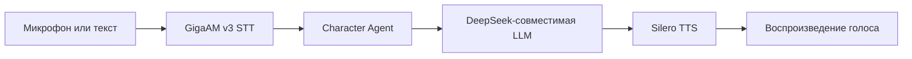
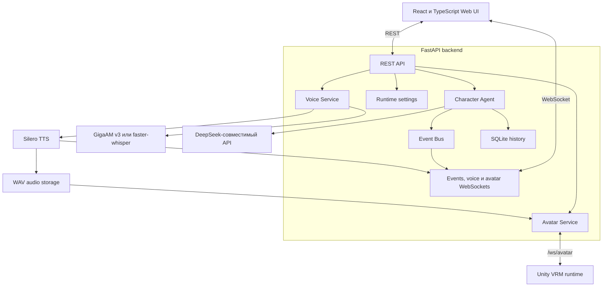

<div align="center">


# Iris

### Локальный голосовой AI‑персонаж и будущая neuro‑VTuber платформа

[](https://github.com/bad1and/NeuroAsist)
[](https://www.python.org/)
[](https://nodejs.org/)
[](https://fastapi.tiangolo.com/)
[](https://react.dev/)
[](LICENSE)

[English](README.md) · **Русский** · [Blueprint V0.5](Docs/NeuroAsist_V0.5_Companion_Blueprint.md)

</div>

> [!IMPORTANT]
> **Iris v0.9 — экспериментальная development-ветка локального desktop-приложения.**
> Tauri запускает React-интерфейс и FastAPI core вместе. Доступны текстовый/голосовой чат, долгосрочная память и опциональный Unity VRM-аватар.

Iris — официальное имя. К ней также можно обращаться: **Ирис**, **Айрис** или **Ириска**.

## О проекте

Iris — локальная панель и backend для AI‑персонажа, который может услышать пользователя, понять запрос, сформировать ответ и озвучить его.

Текущая версия сосредоточена на стабильном голосовом цикле:



Направление V0.5 — desktop-компаньон с одной активной сессией: при новом запуске или ручном сбросе диалог начинается с чистого листа, а управляемая долгосрочная память сохраняется. Внутри сессии используются episodes и summaries. Это не продукт с вручную созданными чатами. В v09 добавлен отдельный строго ограниченный Coding Agent; он не получает live-доступ к проекту и не управляет рабочим столом.

## Возможности v0.9

| Возможность | Статус | Реализация |
|---|:---:|---|
| Текстовый диалог | ✅ | FastAPI chat endpoint |
| Live-диалог | ✅ | Непрерывный PCM16 через AudioWorklet и input WebSocket v3 |
| Live-ответ голосом | ✅ | Аудиосегменты через WebSocket |
| Локальное распознавание речи | ✅ | GigaAM v3, `faster-whisper`/Qwen3-ASR optional fallback |
| Локальная русская озвучка | ✅ | Silero `v5_5_ru` |
| История диалога и Journal | ✅ | SQLite timeline, episodes и summaries |
| Долгосрочная память | 🧪 | Канонические записи SQLite, audit trail и Memory Center |
| Семантический поиск по памяти | 🧪 | Перестраиваемый ChromaDB-индекс с FTS fallback |
| Runtime-события | ✅ | REST и WebSocket |
| Настройка голоса и runtime | ✅ | Локальная React-панель |
| Browser speech fallback | ✅ | При ошибке backend TTS |
| Unity VRM-аватар и lipsync | ✅ | Опциональный WebSocket-клиент с UniVRM/uLipSync |
| Runtime continuous companion | 🧭 | Реализованы timeline, episodes, summaries, управляемая долгосрочная память и проверенный Tauri shell |
| Coding Agent | 🧪 | Очередь задач, отдельные рабочие папки Docker, логи/diff и явное ревью; см. [документ v09](Docs/v09-coding-agent.md) |
| Управление ПК | 🚫 | Вне scope |

### Настройка Coding Agent

Добавьте в `.env` отдельный второй ключ DeepSeek для Coding Agent. Так ключ и
лимиты coding-задач отделены от основного ключа Iris:

```env
CODING_AGENT_ENABLED=true
CODING_API_KEY=ваш_второй_ключ_deepseek
CODING_BASE_URL=https://api.deepseek.com
```

Перед первым запуском Coding Agent соберите Docker-образ. Повторите эту же
команду после изменений в `apps/backend/docker/coding.Dockerfile`: она
пересоберёт локальный образ `neuroasist-coding` с тем же стабильным тегом.

```powershell
docker build -t neuroasist-coding -f apps/backend/docker/coding.Dockerfile apps/backend/docker
```

## Основные идеи

- **Local-first обработка голоса** — STT и TTS работают на компьютере пользователя.
- **Быстрый текстовый ответ** — текст можно вернуть раньше, чем закончится фоновая генерация TTS.
- **Устойчивость к ошибкам озвучки** — падение TTS не уничтожает готовый ответ.
- **Наблюдаемый runtime** — события backend, chat, STT, TTS и WebSocket видны в интерфейсе.
- **Модульная структура** — LLM, STT, TTS, storage, events и agents разделены по ответственности.
- **Ограниченный текущий scope** — companion не выполняет команды, не читает файлы и не управляет рабочим столом.

## Интерфейс

В React-панели есть пять основных разделов:

- **Chat** — текстовые сообщения, кнопка `Live`, распознанная фраза, ответ и воспроизведение.
- **Journal** — непрерывная timeline и внутренние эпизоды разговора.
- **Memory** — сохранённые факты, их происхождение, проверка и полный сброс памяти с историей.
- **Events** — события backend, LLM, STT, TTS и соединений в реальном времени.
- **Settings** — язык голоса, speaker Silero, скорость воспроизведения, live prebuffer, runtime-настройки и тестовое управление аватаром.

В шапке отображаются состояние backend, подключение WebSocket, наличие API-ключа и фиксированная LLM-модель.

## Технологический стек

### Backend

- Python 3.12+
- FastAPI
- Pydantic Settings
- SQLite
- WebSocket
- GigaAM v3
- `faster-whisper` как мультиязычный fallback
- Silero TTS
- DeepSeek-совместимый LLM API

### Frontend

- React 19
- TypeScript
- Vite
- Vitest
- Browser AudioWorklet + Web Audio API
- Web Audio API

## Быстрый запуск

### Требования

- основная платформа разработки — Windows 10/11;
- Python **3.12+**;
- Node.js **24+**;
- FFmpeg и FFprobe доступны через `PATH`;
- API-ключ DeepSeek;
- интернет при первой загрузке GigaAM/Whisper и Silero;
- CUDA-видеокарта необязательна.

### 1. Клонирование ветки

```powershell
git clone --branch v0.6 --single-branch https://github.com/bad1and/NeuroAsist.git Iris
cd Iris
```

### 2. Python-окружение

```powershell
python -m venv .venv
.\.venv\Scripts\Activate.ps1
python -m pip install --upgrade pip
python -m pip install -r requirements.txt --extra-index-url https://download.pytorch.org/whl/cu128
```

Текущий lockfile использует проверенную CUDA-сборку `torch==2.11.0+cu128`. Нужны
NVIDIA-видеокарта и совместимый драйвер. Проверка установки:

```powershell
python -c "import torch; print(torch.cuda.is_available()); print(torch.cuda.get_device_name(0))"
```

Если CUDA недоступна, установи совместимую CPU-сборку PyTorch и укажи в `.env`
`VOICE_STT_DEVICE=cpu` и `VOICE_SILERO_DEVICE=cpu`.

### 3. Frontend-зависимости

```powershell
npm install
npm install --prefix apps/web
npm install --prefix apps/desktop
```

### 4. Конфигурация

```powershell
Copy-Item .env.example .env
```

Минимально нужно указать:

```env
DEEPSEEK_API_KEY=your_deepseek_api_key
```

Стандартная голосовая конфигурация:

```env
VOICE_STT_PROVIDER=gigaam
VOICE_STT_MODEL=v3_rnnt
VOICE_STT_DEVICE=cpu

VOICE_TTS_ENABLED=true
VOICE_TTS_PROVIDER=silero
VOICE_PRELOAD_TTS_MODEL=true
VOICE_SILERO_MODEL=v5_5_ru
VOICE_SILERO_SPEAKER_RU=baya
VOICE_SILERO_SAMPLE_RATE=48000
VOICE_SILERO_DEVICE=cpu
VOICE_SILERO_CPU_THREADS=4
VOICE_SILERO_WARMUP=true
VOICE_STRESS_ENABLED=true
VOICE_STRESS_CPU_THREADS=1
VOICE_TTS_POSTPROCESSING_ENABLED=true
VOICE_TTS_HIGHPASS_CUTOFF_HZ=60
VOICE_TTS_ADAPTIVE_PROSODY=true
```

### Справочник параметров окружения

`.env` читается при запуске backend. Если меняешь `.env`, перезапусти backend. Настройки, изменённые через UI, действуют только в текущем runtime и сбрасываются после перезапуска backend.

#### Основной backend

| Параметр | За что отвечает |
|---|---|
| `DEEPSEEK_API_KEY` | API-ключ DeepSeek-совместимого сервиса. Нужен для реальных ответов LLM. |
| `DEEPSEEK_BASE_URL` | Базовый URL DeepSeek-совместимого API. |
| `DEEPSEEK_MODEL` | Фиксированная LLM-модель для backend routes. UI не меняет её в runtime. |
| `SQLITE_PATH` | Путь к SQLite-базе с сессиями и историей диалога. |
| `CHAT_HISTORY_LIMIT` | Сколько последних сообщений передаётся обратно в контекст чата. |
| `LOG_LEVEL` | Детальность логов backend, например `DEBUG`, `INFO`, `WARNING`, `ERROR`. |
| `LOG_TO_FILE` | Включает запись логов backend в файл. |
| `LOG_FILE_PATH` | Путь к файлу логов, если `LOG_TO_FILE=true`. |
| `CORS_ORIGINS` | Список разрешённых frontend origin через запятую. |
| `CORS_ORIGIN_REGEX` | Regex для разрешённых локальных development origin. |

#### Speech-to-text

| Параметр | За что отвечает |
|---|---|
| `VOICE_STT_PROVIDER` | STT-провайдер: `gigaam` для русского, `faster_whisper` для мультиязычного режима, `qwen3_asr` для optional Qwen3-ASR, `mock` для тестов. |
| `VOICE_STT_MODEL` | Модель провайдера: `v3_rnnt`/`v3_e2e_rnnt` для GigaAM, `large-v3-turbo` для faster-whisper или `Qwen/Qwen3-ASR-1.7B` для Qwen3-ASR. |
| `VOICE_STT_FALLBACK_PROVIDER` | Необязательная вторичная локальная модель (`faster_whisper`, `qwen3_asr` или `gigaam`). Загружается только при необходимости. |
| `VOICE_STT_FALLBACK_MODEL` | Модель вторичного провайдера. Для Qwen по умолчанию используется `Qwen/Qwen3-ASR-1.7B`. |
| `VOICE_STT_FALLBACK_CONFIDENCE_THRESHOLD` | Порог confidence для запуска secondary STT, по умолчанию `0.60`. |
| `VOICE_STT_FALLBACK_MIN_RMS` | Нижний порог уровня PCM для low-SNR fallback, по умолчанию `0.008`. |
| `VOICE_STT_DEVICE` | Где запускать STT: `cpu`, `cuda` или `auto`. |
| `VOICE_STT_COMPUTE_TYPE` | Тип вычислений только для faster-whisper, например `int8` для CPU или `int8_float16` для CUDA. GigaAM игнорирует параметр. |
| `VOICE_DEFAULT_LANGUAGE` | Язык по умолчанию для STT и голосового UI, например `ru`. |
| `VOICE_PRELOAD_STT_MODEL` | Загружает STT-модель при старте backend, а не при первой записи. |
| `VOICE_STT_TIMEOUT_SECONDS` | Максимальное время на один STT-запрос. |
| `VOICE_MAX_UPLOAD_MB` | Максимальный размер загружаемого аудио. |
| `VOICE_MAX_RECORD_SECONDS` | Максимальная длительность принимаемой записи. |

Для русского голосового ассистента базовым кандидатом остаётся `gigaam` +
`v3_rnnt`: он ориентирован на точное распознавание слов. `v3_e2e_rnnt`
формирует более читаемый текст с пунктуацией и нормализацией чисел. Текущий
локальный baseline на 20 коротких записях — около `18.3% WER`; это не release-
метрика, а точка сравнения для расширенного приватного корпуса. Окончательный
выбор делается только после одинакового benchmark для GigaAM RNNT/E2E,
`large-v3-turbo` и optional Qwen3-ASR.

Qwen3-ASR подключается отдельно в чистом окружении:

```powershell
pip install -U qwen-asr
```

После установки кандидат можно прогнать так:

```powershell
.\.venv\Scripts\python.exe scripts\benchmark_stt.py candidate `
  --manifest Audio\stt-manifest.json `
  --output output\stt-qwen.json `
  --provider qwen3_asr `
  --model Qwen/Qwen3-ASR-1.7B
```

#### Text-to-speech / Silero

| Параметр | За что отвечает |
|---|---|
| `VOICE_TTS_ENABLED` | Включает backend-озвучку. Если она выключена или упала, frontend может использовать browser SpeechSynthesis fallback. |
| `VOICE_TTS_PROVIDER` | Backend TTS-провайдер. Рабочее значение — `silero`; `mock` только для тестов. Edge TTS не поддерживается. |
| `VOICE_PRELOAD_TTS_MODEL` | Загружает и прогревает Silero при старте backend. Первый запуск может быть дольше. |
| `VOICE_SILERO_MODEL` | Имя модели Silero. Текущее значение по умолчанию — `v5_5_ru`. |
| `VOICE_SILERO_SPEAKER_RU` | Русский speaker Silero по умолчанию, например `xenia`. Можно менять в runtime через Settings. |
| `VOICE_SILERO_SAMPLE_RATE` | Sample rate WAV-файлов Silero. Текущее значение — `48000`; изменение требует перезапуска backend. |
| `VOICE_SILERO_DEVICE` | Где запускать Silero: `cpu`, `cuda` или `auto`. |
| `VOICE_SILERO_CPU_THREADS` | Сколько CPU-потоков PyTorch использует для Silero inference. |
| `VOICE_SILERO_WARMUP` | Запускает короткую warmup-фразу после загрузки Silero, чтобы первый реальный TTS был быстрее. |
| `VOICE_SILERO_TIMEOUT_SECONDS` | Timeout на синтез одной фразы. |
| `VOICE_STRESS_ENABLED` | Использует локальный Silero Stress для явной расстановки русских ударений перед TTS. При ошибке загрузки остаётся встроенное автоударение v5_5_ru. |
| `VOICE_STRESS_CPU_THREADS` | Запрашиваемый лимит CPU-потоков акцентатора; пакетная модель по умолчанию использует один поток. |
| `VOICE_TTS_POSTPROCESSING_ENABLED` | Включает удаление DC-смещения, high-pass, антищелчковые fades и безопасную нормализацию WAV. |
| `VOICE_TTS_HIGHPASS_CUTOFF_HZ` | Частота среза низкочастотного гула при включённой постобработке; по умолчанию `60`. |
| `VOICE_TTS_ADAPTIVE_PROSODY` | Добавляет безопасные смысловые паузы между частями фразы, сохраняя нативную выразительность Silero. Выключите для сравнения с базовым звучанием. |
| `VOICE_TTS_BACKGROUND_TIMEOUT_SECONDS` | Timeout фоновых TTS jobs, если они используются внутренним voice pipeline. |
| `VOICE_TTS_TIMEOUT_SECONDS` | Общий timeout TTS для voice API flow. |
| `VOICE_TTS_MAX_CHARS` | Максимальная длина текста для одного backend TTS-запроса. |
| `VOICE_AUDIO_DIR` | Папка, куда сохраняются сгенерированные аудиофайлы. WAV удаляются при старте backend, затем раз в 20 минут удаляются файлы старше 2 минут. |

#### Live voice playback

| Параметр | За что отвечает |
|---|---|
| `VOICE_LIVE_QUEUE_SIZE` | Размер внутренней очереди live-ответа. |
| `VOICE_LIVE_IDLE_FLUSH_MS` | Задержка перед отправкой последнего неполного live-сегмента. |
| `VOICE_LIVE_FIRST_IDLE_FLUSH_MS` | Idle-flush первого произносимого фрагмента, по умолчанию `180` мс. |
| `VOICE_LIVE_NEXT_IDLE_FLUSH_MS` | Idle-flush следующих фрагментов, по умолчанию `350` мс. |
| `VOICE_LIVE_PLAYBACK_START_LEAD_MS` | Запас планирования browser playback, по умолчанию `30` мс. |
| `VOICE_LIVE_FIRST_SEGMENT_CHARS` | Целевой размер первого live TTS-сегмента. |
| `VOICE_LIVE_NEXT_SEGMENT_CHARS` | Целевой размер следующих live TTS-сегментов. |
| `VOICE_LIVE_MAX_SEGMENT_CHARS` | Жёсткий лимит символов для одного live TTS-сегмента. |
| `VOICE_LIVE_MAX_SEGMENT_WORDS` | Жёсткий лимит слов для одного live TTS-сегмента. |
| `VOICE_LIVE_SAFE_SEGMENT_WORDS` | Максимальный размер цельной разговорной мысли перед поиском естественного разреза. Значение `18` по умолчанию уменьшает эффект склейки фрагментов. |
| `VOICE_LIVE_TTS_RETRY_COUNT` | Сколько раз повторять генерацию упавшего live TTS-сегмента. |
| `VOICE_LIVE_TTS_CONCURRENCY_MODE` | Режим параллельности live TTS. Значение `1` по умолчанию сохраняет простой и стабильный порядок сегментов. |
| `VOICE_LIVE_TTS_CONCURRENCY_MIN` | Нижняя граница параллельности live TTS. |
| `VOICE_LIVE_TTS_CONCURRENCY_MAX` | Верхняя граница параллельности live TTS. |
| `VOICE_LIVE_PLAYBACK_PREBUFFER_SEGMENTS` | Сколько декодированных live-сегментов буферизовать перед стартом воспроизведения. Можно менять в runtime через Settings. |
| `VOICE_LIVE_PLAYBACK_PREBUFFER_MS` | Дополнительная задержка live prebuffer в миллисекундах. Можно менять в runtime через Settings. |

#### Распознавание речи и VAD

| Параметр | За что отвечает |
|---|---|
| `VOICE_VAD_PROVIDER` | Streaming VAD: локальный `silero` по умолчанию или явный `energy`. |
| `VOICE_SILERO_VAD_MODEL_PATH` | Необязательный TorchScript override. При ошибке используется модель из `silero-vad==6.2.1`, затем energy fallback. |
| `VOICE_SILERO_VAD_START_THRESHOLD` / `VOICE_SILERO_VAD_END_THRESHOLD` | Вероятности старта/окончания Silero: `0.55` / `0.35`. |
| `VOICE_ENERGY_VAD_START_RMS` / `VOICE_ENERGY_VAD_END_RMS` | Пороги RMS только для energy fallback: `0.018` / `0.012`. |
| `VOICE_VAD_PRE_ROLL_MS` / `VOICE_VAD_POST_ROLL_MS` | Сохраняемый контекст до и после речи: `900` / `180` мс. Значение pre-roll ниже 900 мс безопасно повышается во время запуска. |
| `VOICE_VAD_END_SILENCE_MS` / `VOICE_VAD_LIVE_END_SILENCE_MS` | Базовый и live endpoint со SmartTurn: `720` / `750` мс. Более короткие значения автоматически поднимаются до безопасного минимума выбранного профиля паузы. |
| `VOICE_VAD_LIVE_FALLBACK_END_SILENCE_MS` | Осторожный live endpoint без SmartTurn: `1100` мс. |
| `VOICE_TORCH_CPU_THREADS` / `VOICE_TORCH_INTEROP_THREADS` | Общая настройка PyTorch до загрузки всех голосовых моделей: `4` / `1`. |
| `VOICE_STT_TERMS_PATH` | Отдельный JSON точных aliases для STT; по умолчанию `stt-terms.json` в приватных app-data. |
| `VOICE_INPUT_DIAGNOSTIC_AUDIO` | Сохранять canonical WAV и JSON в приватную diagnostic-папку. По умолчанию `false`. |

#### Unity avatar bridge

| Параметр | За что отвечает |
|---|---|
| `AVATAR_ENABLED` | Включает отправку команд аватара подключённым Unity-клиентам. По умолчанию выключен, поэтому Unity остаётся опциональным. |
| `AVATAR_HEARTBEAT_INTERVAL_SECONDS` | Интервал heartbeat-ping от backend к Unity-клиентам. |
| `AVATAR_CLIENT_TIMEOUT_SECONDS` | Время без heartbeat, после которого Unity-клиент отключается. |

#### Frontend

| Параметр | За что отвечает |
|---|---|
| `VITE_API_BASE_URL` | HTTP URL backend, который использует React-приложение. |
| `VITE_WS_EVENTS_URL` | WebSocket URL backend для событий и live voice. |

### 5. Проверка FFmpeg

```powershell
ffmpeg -version
ffprobe -version
```

Если Windows не видит FFmpeg в текущем терминале:

```powershell
$env:Path = "<ffmpeg-bin>;$env:Path"
```

### 6. Запуск desktop-приложения (рекомендуется)

```powershell
npm --prefix apps/desktop run dev
```

Одна команда запускает Vite и локальный FastAPI core; отдельно поднимать backend или открывать браузер не нужно. Параметры сборки аватара описаны в [desktop README](apps/desktop/README.md).

### 7. Раздельный запуск backend и web UI (опционально)

```powershell
.\.venv\Scripts\Activate.ps1
python -m uvicorn main:app --host 127.0.0.1 --port 8000 --reload
```

### 8. Запуск frontend

Открой второй терминал:

```powershell
npm --prefix apps/web run dev
```

Открыть:

- Web UI: `http://127.0.0.1:5173`
- OpenAPI: `http://127.0.0.1:8000/docs`
- Health check: `http://127.0.0.1:8000/health`

## Архитектура



Backend построен как модульный монолит: API routes, agents, voice providers, runtime settings, events и storage работают внутри одного Python-приложения, а веб-интерфейс является отдельным Vite-приложением.

Так прототип проще запускать, отлаживать и развивать без лишнего инфраструктурного зоопарка.

## Голосовой pipeline

### Live-диалог

```text
Кнопка Live
  → AudioWorklet PCM16 stream
  → input WebSocket v3
  → backend VAD + Smart Turn
  → GigaAM v3
  → Character Agent
  → DeepSeek-совместимая LLM
  → потоковый live TTS
  → очередь воспроизведения
```

После запуска `Live` пользователь не управляет отдельными репликами: начало и
конец мысли определяются backend VAD и Smart Turn. При подтверждённом barge-in
воспроизведение останавливается сразу, а старое поколение ответа блокируется.

### Live-ответ

```text
Поток текста LLM
  → безопасные текстовые сегменты
  → WAV-сегменты Silero
  → voice WebSocket
  → очередь воспроизведения в браузере
```

Для live-режима настраиваются размер сегментов, лимит очереди, параллельность
TTS и prebuffer воспроизведения.

### Воспроизведение Unity-аватаром

```text
Текстовый или live-голосовой ответ
  → фоновая генерация Silero
  → voice.tts_ready
  → URL полного WAV
  → avatar.speak через /ws/avatar
  → Unity AudioSource, lipsync и VRM-эмоция
```

Мост аватара остаётся опциональным: недоступный Unity-клиент не задерживает чат или TTS. Исходники renderer лежат в [`apps/avatar-unity`](apps/avatar-unity/README.md); Tauri запускает его с динамическим портом и одноразовым токеном.

В **Настройки → Система → Аватар** можно выбрать размещение. В Windows режим **«Внутри Iris»** показывает Unity как прозрачную нативную поверхность под управлением окна Iris в нижней левой колонке экрана «Диалог»: она повторяет размеры chat-слота с учётом DPI, не появляется в Alt+Tab и не создаёт второго самостоятельного окна приложения. Режим **«Отдельным оверлеем»** сохраняет desktop-companion с click-through, перетаскиванием, масштабом и управлением из трея. В обоих режимах Unity остаётся контролируемым дочерним процессом Tauri, поэтому протокол речи, lipsync, эмоции и жесты не меняются.

## Структура проекта

```text
Iris/
├── apps/
│   ├── backend/
│   │   ├── main.py
│   │   └── app/
│   │       ├── agents/
│   │       ├── avatar/
│   │       ├── api/
│   │       ├── core/
│   │       ├── events/
│   │       ├── llm/
│   │       ├── runtime/
│   │       ├── schemas/
│   │       ├── storage/
│   │       └── voice/
│   └── web/
│       └── src/
├── Docs/
│   ├── NeuroAsist_V0.5_Companion_Blueprint.md
│   ├── milestone-0-freeze.md
│   └── version-manifest-v0.4.1.json
├── scripts/
├── tests/
├── main.py
├── requirements.txt
└── package.json
```

## Команды разработки

Backend-тесты:

```powershell
.\.venv\Scripts\python.exe -m pytest
```

Frontend-тесты:

```powershell
npm test --prefix apps/web
```

Сборка frontend:

```powershell
npm run build
```

Benchmark Silero:

```powershell
python scripts/benchmark_tts.py --provider silero --device cpu --runs 5
python scripts/benchmark_tts.py --provider silero --device cuda --runs 5
```

Benchmark записывает результат в `data/tts_benchmark.json` и выводит P50/P95 задержку синтеза и real-time factor.

Для реального STT-корпуса открой «Настройки → Голос → Собрать приватный
STT-корпус». Guided capture использует тот же `BrowserVadRecorder`, хранит
записи только в IndexedDB браузера и позволяет выгрузить WAV вместе с manifest.

```powershell
.\.venv\Scripts\python.exe scripts/benchmark_stt.py baseline --manifest путь\stt-manifest.json --output data\stt-baseline.json --streaming-replay
.\.venv\Scripts\python.exe scripts/benchmark_stt.py candidate --manifest путь\stt-manifest.json --output data\stt-candidate.json --streaming-replay
.\.venv\Scripts\python.exe scripts/benchmark_stt.py compare --baseline data\stt-baseline.json --candidate data\stt-candidate.json --output data\stt-compare.json
```

Режим `threads` сравнивает 1/2/4/8 потоков PyTorch в отдельных subprocess.
Приватные записи и диагностическое аудио добавлены в `.gitignore`.

## Устранение проблем

### Silero при запуске останавливается на `Using cache found ... snakers4_silero-models_master`

Эта строка не означает успешную загрузку модели. Она говорит только о том, что PyTorch Hub нашёл кэш репозитория Silero. При свежей или неполной установке после этого всё равно может докачиваться сам checkpoint модели.

Если в `app.log` есть `CERTIFICATE_VERIFY_FAILED` или `certificate has expired`, скачивание модели упало на HTTPS-проверке сертификата. На проблемной Windows-машине:

```powershell
# 1. Проверь дату, время, часовой пояс Windows и установи обновления корневых сертификатов через Windows Update.

# Временный обход для запуска backend, пока чинишь первую загрузку Silero.
# TTS повторит lazy-load при первом использовании.
$env:VOICE_PRELOAD_TTS_MODEL = "false"

# 2. Обнови certificate-related Python-пакеты внутри venv проекта.
.\.venv\Scripts\python.exe -m pip install --upgrade pip certifi requests urllib3

# 3. Укажи OpenSSL/Python использовать certifi в текущей сессии терминала.
$env:SSL_CERT_FILE = (& .\.venv\Scripts\python.exe -c "import certifi; print(certifi.where())")

# 4. Удали возможный неполный кэш Torch Hub.
Remove-Item -Recurse -Force "$env:USERPROFILE\.cache\torch\hub\snakers4_silero-models_master" -ErrorAction SilentlyContinue
Remove-Item -Recurse -Force "$env:USERPROFILE\.cache\torch\hub\checkpoints" -ErrorAction SilentlyContinue

# 5. Запусти backend снова.
.\.venv\Scripts\python.exe -m uvicorn main:app --host 127.0.0.1 --port 8000 --reload
```

Если на машине есть корпоративная сеть, антивирус или HTTPS inspection, нужно разрешить Python доступ к GitHub/PyTorch downloads или подготовить Torch cache на другой машине и скопировать `%USERPROFILE%\.cache\torch` в профиль нужного пользователя.

### GigaAM STT

При первом запуске GigaAM скачивает checkpoint `v3_rnnt` размером около `426 МБ` в `%USERPROFILE%\.cache\gigaam`. Для русского языка рекомендуется CPU: на Ryzen 7 5700X короткие реплики оказались быстрее, чем на GTX 1660 SUPER, и STT не занимает VRAM. Проверка установленного провайдера:

```powershell
.\.venv\Scripts\python.exe -c "import asyncio; from apps.backend.app.voice.providers import GigaAMSTTProvider; p=GigaAMSTTProvider('v3_rnnt','cpu'); asyncio.run(p.preload()); print('gigaam ok', p._selected_device)"
```

`v3_rnnt` предназначен прежде всего для русского. Для английской или смешанной речи переключись на:

```env
VOICE_STT_PROVIDER=faster_whisper
VOICE_STT_MODEL=large-v3-turbo
VOICE_STT_DEVICE=cuda
VOICE_STT_COMPUTE_TYPE=int8_float16
```

### faster-whisper уходит на CPU на Windows

Если в логах есть:

```text
FasterWhisper CUDA runtime failed, retrying on CPU
```

значит драйвер NVIDIA видит видеокарту, но CTranslate2 не находит CUDA runtime DLL, которые нужны `faster-whisper` (`cuBLAS` и `cuDNN`). Локальный фикс только для этого проекта: скачать CUDA 12 bundle и положить DLL рядом с Python из venv:

```powershell
# 1. Скачай CUDA 12 cuBLAS/cuDNN bundle. Архив большой.
New-Item -ItemType Directory -Force -Path .cache\ct2-cuda
Invoke-WebRequest -Uri "https://github.com/Purfview/whisper-standalone-win/releases/download/libs/cuBLAS.and.cuDNN_CUDA12_win_v3.7z" -OutFile ".cache\ct2-cuda\cuBLAS.and.cuDNN_CUDA12_win_v3.7z"

# 2. Скачай маленький standalone-распаковщик 7-Zip.
New-Item -ItemType Directory -Force -Path .cache\7zip
Invoke-WebRequest -Uri "https://www.7-zip.org/a/7za920.zip" -OutFile ".cache\7zip\7za920.zip"
Expand-Archive -Force ".cache\7zip\7za920.zip" ".cache\7zip"

# 3. Проверь и распакуй CUDA DLL archive.
.\.cache\7zip\7za.exe t .cache\ct2-cuda\cuBLAS.and.cuDNN_CUDA12_win_v3.7z
$out = (Resolve-Path .cache\ct2-cuda).Path + "\extracted"
New-Item -ItemType Directory -Force -Path $out
.\.cache\7zip\7za.exe x .cache\ct2-cuda\cuBLAS.and.cuDNN_CUDA12_win_v3.7z "-o$out" -y

# 4. Сделай DLL видимыми для venv проекта.
Copy-Item -Force .cache\ct2-cuda\extracted\*.dll .venv\Scripts\

# 5. Проверь прямую CUDA-загрузку faster-whisper.
.\.venv\Scripts\python.exe -c "from faster_whisper import WhisperModel; WhisperModel('large-v3-turbo', device='cuda', compute_type='int8_float16'); print('cuda ok')"

# 6. Проверь, что backend provider в auto-режиме выбирает CUDA.
.\.venv\Scripts\python.exe -c "from apps.backend.app.voice.providers import FasterWhisperSTTProvider; p=FasterWhisperSTTProvider('large-v3-turbo','auto','int8'); p._ensure_model(); print('provider ok', p._selected_device, p._selected_compute_type)"
```

Ожидаемый результат:

```text
cuda ok
provider ok cuda int8_float16
```

При `VOICE_STT_DEVICE=auto` backend сначала пробует `cuda/int8_float16` и уходит на `cpu/int8` только если CUDA-загрузка не удалась. Чтобы жестко закрепить GPU:

```env
VOICE_STT_DEVICE=cuda
VOICE_STT_COMPUTE_TYPE=int8_float16
```

## Текущие ограничения

Версия до ребрендинга, NeuroAsist v0.4.0, пока не умеет:

- постоянно слушать микрофон;
- автоматически вести диалог через VAD;
- прерывать речь персонажа;
- GPU/frame-time capture для конкретной VRM-модели и при необходимости дополнительное упрощение spring bones/материалов;
- давать гарантированно качественный семантический retrieval: ChromaDB-индекс находится в development и использует лёгкие hash embeddings;
- работать с файлами, shell, браузером, экраном или рабочим столом;
- поддерживать аккаунты, публичный production deployment и multi-user isolation.

### Память V0.6

В текущей development-ветке реализован ChromaDB-индекс поверх канонической SQLite-памяти: релевантные факты добавляются в prompt DeepSeek, а один ответ модели может вернуть кандидаты памяти. Индекс хранится в `data/chroma` и может быть пересобран из SQLite. Настройки и текущие ограничения описаны в [ChromaDB memory](Docs/chroma-memory.md).

## Документация проекта

Направление V0.5 и зафиксированный baseline V0.4.1 описаны в:

- **[Blueprint Continuous Companion V0.5](Docs/NeuroAsist_V0.5_Companion_Blueprint.md)**
- **[Запись freeze Milestone 0](Docs/milestone-0-freeze.md)**
- **[Единая timeline Milestone 1](Docs/milestone-1-unified-timeline.md)**
- **[Episode Manager Milestone 2](Docs/milestone-2-episode-manager.md)**
- **[Summaries и Context Manager Milestone 3](Docs/milestone-3-context-manager.md)**
- **[Tauri desktop shell Milestone 4](Docs/milestone-4-desktop-shell.md)**
- **[Долгосрочная память Milestone 5](Docs/milestone-5-long-term-memory.md)**
- **[Семантический поиск Milestone 6](Docs/milestone-6-semantic-retrieval.md)**
- **[Unity avatar renderer](apps/avatar-unity/README.md)**

## Планируемое направление

V0.5 выполняется только по milestones из companion blueprint: freeze, единая timeline, automatic episodes, summaries/context, desktop shell, long-term memory, semantic retrieval, Character Protocol, avatar overlay, live voice, packaging и stabilization. Текущий runtime V0.4 сохраняет совместимость, пока соответствующий milestone не изменит его явно.

## Лицензия

Iris распространяется по [Apache License 2.0](LICENSE).

У сторонних моделей и сервисов могут быть собственные лицензии и условия использования. Перед коммерческим использованием проверь лицензию выбранной Silero-модели и правила LLM-провайдера.
