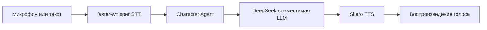
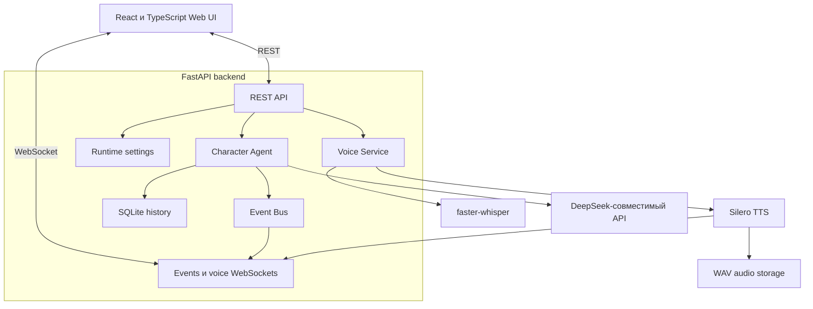

<div align="center">

# NeuroAsist

### Локальный голосовой AI‑персонаж и будущая neuro‑VTuber платформа

[](https://github.com/bad1and/NeuroAsist/tree/v0.3.1)
[](https://www.python.org/)
[](https://nodejs.org/)
[](https://fastapi.tiangolo.com/)
[](https://react.dev/)
[](LICENSE)

[English](README.md) · **Русский** · [Blueprint проекта](Docs/neuro_vtuber_assistant_blueprint_v1.1.md)

</div>

> [!IMPORTANT]
> **NeuroAsist v0.3.1 — экспериментальный локальный прототип.**  
> Текстовый чат, push-to-talk, локальное распознавание речи, локальная озвучка и live-воспроизведение уже реализованы. Аватар, lipsync, доступ к ПК и агент-разработчик планируются в следующих версиях.

## О проекте

NeuroAsist — локальная панель и backend для AI‑персонажа, который может услышать пользователя, понять запрос, сформировать ответ и озвучить его.

Текущая версия сосредоточена на стабильном голосовом цикле:



Долгосрочная цель — превратить это ядро в модульную neuro‑VTuber платформу с анимированным аватаром, эмоциями, памятью, контролируемыми инструментами и безопасным агентом-разработчиком.

## Возможности v0.3.1

| Возможность | Статус | Реализация |
|---|:---:|---|
| Текстовый диалог | ✅ | FastAPI chat endpoint |
| Push-to-talk | ✅ | Browser `MediaRecorder` |
| Live-ответ голосом | ✅ | Аудиосегменты через WebSocket |
| Локальное распознавание речи | ✅ | `faster-whisper` |
| Локальная русская озвучка | ✅ | Silero `v5_5_ru` |
| История диалога | ✅ | SQLite |
| Runtime-события | ✅ | REST и WebSocket |
| Настройка модели и голоса | ✅ | Локальная React-панель |
| Browser speech fallback | ✅ | При ошибке backend TTS |
| Аватар и lipsync | 🧭 | Планируется |
| Dev-agent и sandbox | 🧭 | Планируется |
| Контекст экрана и ПК | 🧭 | Планируется |

## Основные идеи

- **Local-first обработка голоса** — STT и TTS работают на компьютере пользователя.
- **Быстрый текстовый ответ** — текст можно вернуть раньше, чем закончится фоновая генерация TTS.
- **Устойчивость к ошибкам озвучки** — падение TTS не уничтожает готовый ответ.
- **Наблюдаемый runtime** — события backend, chat, STT, TTS и WebSocket видны в интерфейсе.
- **Модульная структура** — LLM, STT, TTS, storage, events и agents разделены по ответственности.
- **Ограниченный текущий scope** — v0.3.1 не выполняет команды, не читает файлы и не управляет рабочим столом.

## Интерфейс

В React-панели есть три основных раздела:

- **Chat** — текстовые сообщения, запись микрофона, распознанная фраза, ответ и воспроизведение.
- **Events** — события backend, LLM, STT, TTS и соединений в реальном времени.
- **Settings** — выбор поддерживаемой модели, языка и TTS-голоса.

В шапке отображаются состояние backend, подключение WebSocket, наличие API-ключа и текущая модель.

## Технологический стек

### Backend

- Python 3.12+
- FastAPI
- Pydantic Settings
- SQLite
- WebSocket
- `faster-whisper`
- Silero TTS
- DeepSeek-совместимый LLM API

### Frontend

- React 19
- TypeScript
- Vite
- Vitest
- Browser MediaRecorder
- Web Audio API

## Быстрый запуск

### Требования

- основная платформа разработки — Windows 10/11;
- Python **3.12+**;
- Node.js **24+**;
- FFmpeg и FFprobe доступны через `PATH`;
- API-ключ DeepSeek;
- интернет при первой загрузке Whisper и Silero;
- CUDA-видеокарта необязательна.

### 1. Клонирование ветки

```powershell
git clone --branch v0.3.1 --single-branch https://github.com/bad1and/NeuroAsist.git
cd NeuroAsist
```

### 2. Python-окружение

```powershell
python -m venv .venv
.\.venv\Scripts\Activate.ps1
python -m pip install --upgrade pip
python -m pip install -r requirements.txt
```

PyTorch устанавливается отдельно. Самый переносимый вариант — CPU:

```powershell
python -m pip install torch --index-url https://download.pytorch.org/whl/cpu
python -m pip install silero
```

Для CUDA установи сборку PyTorch, подходящую под драйвер и CUDA runtime.

### 3. Frontend-зависимости

```powershell
npm install
npm install --prefix apps/web
```

### 4. Конфигурация

```powershell
Copy-Item .env.example .env
```

Минимально нужно указать:

```env
DEEPSEEK_API_KEY=your_deepseek_api_key
```

Стандартная голосовая конфигурация:

```env
VOICE_STT_PROVIDER=faster_whisper
VOICE_STT_MODEL=small
VOICE_STT_DEVICE=auto
VOICE_STT_COMPUTE_TYPE=int8

VOICE_TTS_ENABLED=true
VOICE_TTS_PROVIDER=silero
VOICE_PRELOAD_TTS_MODEL=true
VOICE_SILERO_MODEL=v5_5_ru
VOICE_SILERO_SPEAKER_RU=xenia
VOICE_SILERO_SAMPLE_RATE=24000
VOICE_SILERO_DEVICE=cpu
VOICE_SILERO_CPU_THREADS=4
VOICE_SILERO_WARMUP=true
```

### 5. Проверка FFmpeg

```powershell
ffmpeg -version
ffprobe -version
```

Если Windows не видит FFmpeg в текущем терминале:

```powershell
$env:Path = "C:\Path\To\ffmpeg\bin;$env:Path"
```

### 6. Запуск backend

```powershell
.\.venv\Scripts\Activate.ps1
python -m uvicorn main:app --host 127.0.0.1 --port 8000 --reload
```

### 7. Запуск frontend

Открой второй терминал:

```powershell
npm --prefix apps/web run dev
```

Открыть:

- Web UI: `http://127.0.0.1:5173`
- OpenAPI: `http://127.0.0.1:8000/docs`
- Health check: `http://127.0.0.1:8000/health`

## Архитектура



Backend построен как модульный монолит: API routes, agents, voice providers, runtime settings, events и storage работают внутри одного Python-приложения, а веб-интерфейс является отдельным Vite-приложением.

Так прототип проще запускать, отлаживать и развивать без лишнего инфраструктурного зоопарка.

## Голосовой pipeline

### Обычный push-to-talk

```text
Browser MediaRecorder
  → POST /voice/chat
  → faster-whisper
  → Character Agent
  → DeepSeek-совместимая LLM
  → быстрый текстовый ответ
  → фоновая генерация Silero
  → готовый WAV-файл
```

Текст возвращается раньше завершения TTS. Интерфейс получает готовое аудио, когда генерация закончилась.

### Live-ответ

```text
Поток текста LLM
  → безопасные текстовые сегменты
  → WAV-сегменты Silero
  → voice WebSocket
  → очередь воспроизведения в браузере
```

Для live-режима настраиваются размер сегментов, лимит очереди, параллельность TTS и prebuffer воспроизведения.

## Структура проекта

```text
NeuroAsist/
├── apps/
│   ├── backend/
│   │   ├── main.py
│   │   └── app/
│   │       ├── agents/
│   │       ├── api/
│   │       ├── core/
│   │       ├── events/
│   │       ├── llm/
│   │       ├── runtime/
│   │       ├── schemas/
│   │       ├── storage/
│   │       └── voice/
│   └── web/
│       └── src/
├── Docs/
│   └── neuro_vtuber_assistant_blueprint_v1.1.md
├── scripts/
├── tests/
├── main.py
├── requirements.txt
└── package.json
```

## Команды разработки

Backend-тесты:

```powershell
.\.venv\Scripts\python.exe -m pytest
```

Frontend-тесты:

```powershell
npm test --prefix apps/web
```

Сборка frontend:

```powershell
npm run build
```

Benchmark Silero:

```powershell
python scripts/benchmark_tts.py --provider silero --device cpu --runs 5
python scripts/benchmark_tts.py --provider silero --device cuda --runs 5
```

Benchmark записывает результат в `data/tts_benchmark.json` и выводит P50/P95 задержку синтеза и real-time factor.

## Текущие ограничения

NeuroAsist v0.3.1 пока не умеет:

- постоянно слушать микрофон;
- автоматически вести диалог через VAD;
- прерывать речь персонажа;
- отображать аватар и lipsync;
- хранить долгосрочную семантическую память или использовать RAG;
- работать с файлами, shell, браузером, экраном или рабочим столом;
- поддерживать аккаунты, публичный production deployment и multi-user isolation.

## Документация проекта

Текущая архитектура, долгосрочная идея и направление разработки описаны в единственном основном документе:

- **[Neuro‑VTuber Assistant Blueprint v1.1](Docs/neuro_vtuber_assistant_blueprint_v1.1.md)**

## Планируемое направление

Проект предполагается развивать поэтапно:

1. стабильное текстовое и голосовое общение;
2. интеграция VRM- или Unity-аватара;
3. эмоции, анимации и lipsync;
4. контролируемый dev-agent и sandbox проекта;
5. контекст экрана и опциональная долгосрочная память;
6. модульная мультиагентная платформа.

Точный план может меняться по мере тестирования и разработки прототипа.

## Лицензия

NeuroAsist распространяется по [Apache License 2.0](LICENSE).

У сторонних моделей и сервисов могут быть собственные лицензии и условия использования. Перед коммерческим использованием проверь лицензию выбранной Silero-модели и правила LLM-провайдера.
