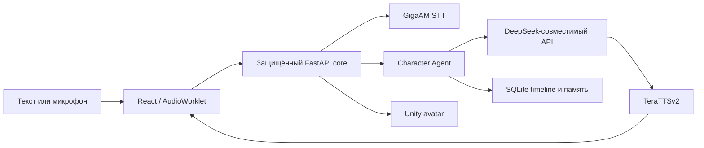

<div align="center">


# Iris

### Локальный голосовой AI-персонаж для Windows

[](VERSION)
[](https://www.python.org/)
[](https://nodejs.org/)
[](https://react.dev/)
[](https://tauri.app/)
[](LICENSE)

[English](README.md) · **Русский** · [Документация](Docs/README.md)

</div>

> [!IMPORTANT]
> Исходный код уже переведён на **Iris 1.0.0**. Локальное приложение функционально; перед публичной публикацией установщик должен пройти отдельный release checklist.

Iris — desktop AI-персонаж с локальным распознаванием и синтезом речи, DeepSeek-совместимой моделью диалога, долгосрочной памятью, живым голосовым режимом и опциональным Unity VRM-аватаром. Tauri объединяет React-интерфейс и защищённый FastAPI core в одно приложение.

## Что работает

| Область | Текущая реализация |
| --- | --- |
| Текст и live voice | Потоковые ответы, непрерывный PCM, VAD, Smart Turn, barge-in и очистка задач при reconnect |
| Локальная речь | GigaAM v3 STT с опциональным fallback; TeraTTSv2 `ru_f1` по умолчанию |
| Персонаж | Устойчивая личность, эмоции, жесты, delivery metadata, настроение и состояние отношений |
| Память | Каноническая SQLite, фоновое извлечение, provenance, audit, FTS и опциональный semantic retrieval |
| Desktop | Tauri 2, tray, single instance, safe mode и защищённый случайный loopback-порт |
| Аватар | Опциональный Unity VRM renderer, lip sync, жесты, overlay или размещение внутри чата |
| Coding Agent | Опциональный Docker-only worker: изолированные snapshots, логи, diff и явное review/apply |
| Диагностика | Runtime events, readiness моделей, token/retry telemetry и backups |

Iris не управляет рабочим столом. Coding Agent работает только в sandbox задачи и не имеет fallback на host shell.

## Схема runtime



Подробнее: [Архитектура](Docs/architecture.md).

## Быстрый запуск

### Требования

- Windows 10 или 11;
- Git;
- Python 3.12;
- Node.js 24 и npm 11;
- FFmpeg и FFprobe в `PATH`;
- API-ключ DeepSeek-совместимого сервиса;
- Rust 1.77.2+ и Microsoft C++ Build Tools для разработки Tauri;
- WebView2 Runtime — обычно уже установлен в актуальных версиях Windows.

Опционально:

- Docker Desktop для Coding Agent;
- Unity 2022.3.62f3 только для пересборки аватара;
- NVIDIA GPU для ускорения STT. Стандартный TTS-профиль работает на CPU.

### 1. Клонирование и зависимости

```powershell
git clone https://github.com/bad1and/NeuroAsist.git Iris
cd Iris

python -m venv .venv
.\.venv\Scripts\Activate.ps1
python -m pip install --upgrade pip
python -m pip install -r requirements.txt

npm ci
npm ci --prefix apps/web
npm ci --prefix apps/desktop
```

`requirements.txt` собирает раздельные runtime- и dev-профили. Для CUDA-development сначала установите совместимые `torch` и `torchaudio` из индекса PyTorch, затем выполните обычную команду выше:

```powershell
python -m pip install -r requirements/torch-cu128.txt
```

Оставьте `VOICE_STT_DEVICE=cpu`, если CUDA недоступна. Эти требования относятся к запуску из исходников: Windows installer включает изолированный Python-sidecar и не должен требовать от пользователя Python, Node или Rust. Профили и правила обновления описаны в [документе о зависимостях](Docs/dependencies.md).

### 2. Настройка

```powershell
Copy-Item .env.example .env
```

Запустите Tauri-приложение и введите ключи DeepSeek и Coding API в разделе
**Настройки → Система → API-ключи**. Они хранятся отдельными записями в Windows
Credential Manager и передаются локальному ядру через анонимный канал. Секреты
из `.env` и унаследованных переменных окружения намеренно игнорируются и не
попадают в runtime settings, резервные копии или Git. Все несекретные статические
параметры описаны в [.env.example](.env.example).

### 3. Запуск desktop-приложения

```powershell
npm --prefix apps/desktop run dev
```

Tauri сам запускает Vite и FastAPI core. Для корректной остановки используйте **Quit** в tray или `Ctrl+C`.

### Раздельный browser-режим

Запустите команды в двух окнах PowerShell:

```powershell
.\.venv\Scripts\python.exe -m uvicorn main:app --host 127.0.0.1 --port 8000 --reload
```

```powershell
npm --prefix apps/web run dev
```

Интерфейс откроется на `http://127.0.0.1:5173`, OpenAPI — на `http://127.0.0.1:8000/docs`.
Этот режим предназначен для разработки UI и локального ядра и не получает
API-ключи; для реальных запросов к моделям запускайте development через Tauri.

## Опциональные компоненты

### Coding Agent

```powershell
docker build -t neuroasist-coding:latest -f apps/backend/docker/coding.Dockerfile apps/backend/docker
```

Запустите Docker Desktop, сохраните отдельный Coding API-ключ в настройках
приложения, затем включите агента в соответствующем разделе. Coding Agent не
использует ключ диалоговой модели как запасной. Перед передачей файлов проекта
прочитайте [модель безопасности Coding Agent](Docs/coding-agent.md).

### Unity-аватар

Tauri development автоматически находит уже собранный Unity renderer. Пересборка нужна только после изменений в Unity-проекте:

```powershell
$env:NEUROASIST_UNITY_EDITOR = 'C:\Program Files\Unity\Hub\Editor\2022.3.62f3\Editor\Unity.exe'
npm --prefix apps/desktop run build:avatar
```

Подробности: [README Unity-аватара](apps/avatar-unity/README.md).

## Проверка

```powershell
.\.venv\Scripts\python.exe -m pytest -q
npm --prefix apps/web test
npm --prefix apps/web run build
npm --prefix apps/desktop run check
.\.venv\Scripts\python.exe scripts/check_docs.py
```

Smoke-тесты, backups, чистый запуск и release build описаны в [эксплуатационном руководстве](Docs/operations.md). Условия публичной версии находятся в [release checklist 1.0](Docs/release-checklist.md).

## Данные и приватность

- Desktop-данные лежат в `%LOCALAPPDATA%\NeuroAsist`, если путь не переопределён через `NEUROASIST_APP_DATA_DIR`.
- SQLite является источником истины для timeline, episodes, memory, фоновых jobs и задач Coding Agent.
- Сырой PCM live-микрофона по умолчанию не сохраняется.
- STT и TTS работают локально; запрос и выбранный компактный контекст уходят в настроенный DeepSeek-совместимый endpoint.
- Семантический индекс перестраивается из SQLite и не заменяет канонические данные.
- Coding-контейнеры не имеют сети, live mount проекта и fallback на host shell.

## Структура репозитория

```text
apps/backend/       FastAPI core, character, memory, voice и storage
apps/web/           React 19 интерфейс
apps/desktop/       Tauri 2 shell и release metadata
apps/avatar-unity/  Опциональный Unity VRM renderer
apps/protocol/      Общие character/avatar контракты
Docs/               Актуальная архитектура, эксплуатация и release-документы
scripts/            Build, smoke, benchmark и maintenance-инструменты
tests/              Backend regression и изолированные эксперименты
```

Начните с [индекса документации](Docs/README.md). Старые планы изолированы в [Docs/archive](Docs/archive/README.md) и не являются инструкциями по реализации.

Документы проекта: [Privacy](PRIVACY.md), [Security](SECURITY.md),
[Changelog](CHANGELOG.md) и [Contributing](CONTRIBUTING.md).

## Версии и релизы

`VERSION` — единый источник версии продукта. `package.json`, Cargo и Tauri содержат обязательные для своих инструментов зеркала; `scripts/check_docs.py` проверяет их синхронность. Политика описана в документе [Versioning](Docs/versioning.md).

Сборка Windows installer — отдельная release-операция. Перед публикацией используйте [эксплуатационное руководство](Docs/operations.md) и полностью закройте [release checklist](Docs/release-checklist.md).

## Лицензия

Исходный код распространяется по [Apache 2.0](LICENSE). Для сторонних avatar/motion assets действуют отдельные условия, перечисленные в [THIRD_PARTY_ASSETS.md](THIRD_PARTY_ASSETS.md).
