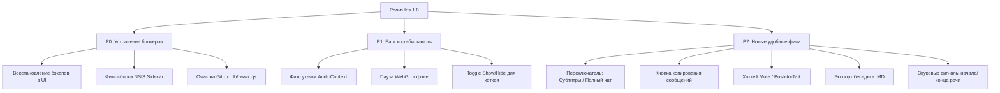

# 🌸 Iris 1.0 — Комплексный релизный аудит

> [!IMPORTANT]
> **Статус аудита**: Исходный код проекта **не изменялся** в соответствии с регламентом аудита.
> Проверена готовность к первому публичному релизу (v1.0.0). Автоматические тесты (`pytest`, `vitest`, `tsc`, `cargo check`) проходят успешно, однако обнаружены критические архитектурные блокеры, риски утечки памяти в аудио-подсистеме и возможности для улучшения UX.

---

## 📊 1. Сводка результатов автоматических проверок

| Контур проверки | Инструмент / Команда | Результат | Комментарий |
| :--- | :--- | :--- | :--- |
| **Python Backend** | `pytest -q` | ✅ **464 passed** (55 warnings) | Базовая регрессия и API зелёные (предупреждения о `torch.jit.load`) |
| **Web Frontend** | `vitest run` | ✅ **121 passed** (17 suites) | Все тесты компонентов и логики UI пройдены |
| **TypeScript / Build** | `tsc --noEmit && vite build` | ✅ **0 ошибок** | Production-сборка компилируется без ошибок типов |
| **Desktop Shell** | `cargo check (Tauri 2)` | ✅ **0 ошибок** | Rust-код и зависимости десктопной оболочки собираются |
| **Документация** | `python scripts/check_docs.py` | ✅ **Passed** | Ссылки и версии `1.0.0` согласованы в Markdown |
| **Текущая Git-ветка** | `git status` | ⚠️ **v0.9** | Рабочая ветка — `v0.9` (требуется слияние/переключение в релизную) |

---

## 🚨 2. Критические блокеры релиза (P0 Release Blockers)

Следующие замечания напрямую блокируют выпуск v1.0 согласно требованиям проектного документа [`Docs/release-checklist.md`](../Docs/release-checklist.md).

### 2.1. Отсутствие механизма восстановления (Restore) резервных копий
> [!WARNING]
> Прямой запрет в чек-листе: *«Публичный релиз нельзя одобрить, пока restore не реализован или не оформлен как проверенная пользовательская процедура.»*

- [ ] **Проблема в Backend**: В сервисе `BackupService` (`apps/backend/app/storage/backups.py`) и маршрутах `maintenance.py` присутствуют только операции `create`, `delete`, `list` и `prune`. Метод `restore` полностью отсутствует.
- [ ] **Проблема в Frontend**: В интерфейсе `App.tsx:3904` отображаются только первые 3 копии (`backups.slice(0, 3)`). Нет кнопки восстановления, нет кнопки удаления и нет выгрузки архива.
- [ ] **План исправления**:
  1. Реализовать метод `BackupService.restore(name_or_file)`: валидация ZIP, распаковка во временную директорию, `PRAGMA integrity_check` для SQLite, атомарная подмена БД при остановленных коннектах.
  2. Добавить эндпоинт `POST /backups/{name}/restore` или `POST /backups/upload`.
  3. В интерфейсе добавить модальное окно подтверждения восстановления с предупреждением о перезаписи текущих данных.

### 2.2. Неконсистентность сборки Sidecar и ресурсов инсталлера (NSIS)
> [!CAUTION]
> На чистой Windows-машине без заранее установленного Python и Node.js приложение после установки упадёт с ошибкой `Bundled Neuro Core is missing`.

- [ ] **Конфиг Tauri**: В `apps/desktop/src-tauri/tauri.conf.json` в секции `bundle.resources` прописан только Unity-аватар (`../../avatar-unity/Builds/NeuroAsistAvatar`). Папка `core` отсутствует в постоянной конфигурации.
- [ ] **Рассинхрон путей**: Скрипт `build-backend-onedir.ps1` собирает PyInstaller в `resources\core\neuroasist-core\neuroasist-core.exe`, а код `main.rs:226` ожидает бинарник по пути `resources\core\neuroasist-core.exe`.
- [ ] **План исправления**: Зафиксировать структуру каталогов для `neuroasist-core` и включить ресурсы бэкенда в постоянный манифест сборщика.

### 2.3. Нарушение политики чистоты репозитория (Security & Privacy Scan)
> [!IMPORTANT]
> Правило `scripts/check_release_artifact.py` запрещает наличие файлов `.db`, `.wav`, `.env` и временных файлов разработки в релизных сборках.

- [ ] В Git-индексе отслеживается `llmdebug.db` (база данных SQLite в корне на 8 КБ).
- [ ] В корне закоммичен файл `01_plain_russian.wav` (1 МБ).
- [ ] В `apps/web/src/` лежат 7 временных скриптов ручной правки: `fix.cjs`, `fix2.cjs`, `fix3.cjs`, `update-state-*.cjs`.
- [ ] В корне присутствуют локальные папки: `from iris/` (дамп ассетов Figma) и `xtts_test/venv/` (второй виртуальный энвайронмент).
- [ ] Висит незакоммиченный diff в `apps/avatar-unity/Assets/NeuroAsistAvatar/Runtime/AvatarRuntimeSettings.cs`.

---

## 🐛 3. Технические баги и риски стабильности

### 3.1. Утечка аппаратных `AudioContext` в браузере (Browser Audio Context Leak)
- **Локация**: `apps/web/src/voice-live.ts:103` и `apps/web/src/App.tsx:1332`
- **Описание**: `TTSStreamPlayer` создаёт новый `AudioContext` при начале стриминга, но метод `.close()` для него никогда не вызывается — ни при `stop()`, ни при смене диалога, ни при анмаунте компонента.
- **Риск**: Chromium / WebView2 имеет жесткий лимит — **максимум 6 одновременно открытых аппаратных AudioContext**. При частых переподключениях или смене устройств вывода воспроизведение звука падает с `DOMException`.
- **Решение**: Добавить метод `destroy()` / `dispose()` в плеер и закрывать контекст при остановке.

### 3.2. Избыточная фоновая нагрузка на GPU от шейдера `IrisMoodOrb`
- **Локация**: `apps/web/src/components/IrisMoodOrb.tsx:372`
- **Описание**: WebGL-сфера настроения запускает непрерывный цикл `requestAnimationFrame` на 60–144 кадров/сек без проверки видимости вкладки или окна.
- **Риск**: При свёрнутом в трей приложении или переключении на вкладку «Кодинг» / «Журнал» GPU и батарея ноутбука продолжают нагружаться тяжелыми вычислениями шума Simplex/Oklab.
- **Решение**: Использовать `document.hidden` (Page Visibility API) или `IntersectionObserver` для паузы рендера, когда сфера не видна.

### 3.3. Логика глобального шортката и отсутствие Toggle Hide
- **Локация**: `apps/desktop/src-tauri/src/main.rs:978, 1060`
- **Описание**: Нажатие `Ctrl+Shift+N` вызывает только `show_main_window(app)`. Повторное нажатие при уже активном окне не сворачивает его.
- **Решение**: Реализовать поведение переключателя (toggle): если окно в фокусе — скрыть (`window.hide()`), если скрыто — развернуть и сфокусировать.

### 3.4. Отсутствие поддержки зеркал Hugging Face в РФ
- **Локация**: `apps/backend/app/voice/providers.py` и `teratts_provider.py`
- **Описание**: При первом скачивании весов GigaAM и TeraTTS v2 обращение идёт напрямую на `huggingface.co`. При блокировках или таймаутах провайдеров приложение зависает на старте.
- **Решение**: Добавить поддержку переменной окружения `HF_ENDPOINT` (например, `https://hf-mirror.com`) и поле для указания зеркала в настройках моделей.

---

## 🎨 4. Недочеты UX/UI и эргономики

### 4.1. Режим чата: только субтитры, нет ленты сообщений
- **Проблема**: В основном окне чата отображаются только 2 строчки субтитров последней реплики Iris (`IrisSubtitles.tsx`). Сообщения пользователя исчезают сразу после отправки. При получении программного кода или списков текст разбивается на обрывки по 45 символов.
- **Решение**: Добавить переключатель в верхней панели чата:
  - Режим **«Субтитры»** (кинематографичный вид с порталом/аватаром).
  - Режим **«Полный диалог»** (классическая лента чата со скроллом, форматированием Markdown и подсветкой кода).

### 4.2. Отсутствие кнопки копирования в буфер обмена (Clipboard API)
- **Проблема**: Во всем веб-интерфейсе нет ни одного использования `navigator.clipboard`. Нельзя скопировать ответ Iris, сниппет кода или лог события в один клик.
- **Решение**: Добавить кнопку «Копировать» в карточки сообщений журнала, окно субтитров и карточки задач кодинг-агента.

### 4.3. Отсутствие глобального Push-to-Talk и Mute
- **Проблема**: Голосовой ассистент не предоставляет глобальной комбинации клавиш для быстрого отключения микрофона без разворачивания окна из трея.
- **Решение**: Зарегистрировать глобальный шорткат (например, `Ctrl+Shift+M`) для переключения микрофона.

### 4.4. Ограниченность управления резервными копиями
- **Проблема**: Отображение жестко ограничено 3 копиями (`backups.slice(0, 3)`), отсутствует удаление устаревших копий и кнопка «Открыть папку с копиями в Проводнике».

---

## 💡 5. Предлагаемые новые фичи к релизу v1.0 (Low effort, high impact)

1. **Режим «Полный чат» в окне диалога**
   - Переключатель между компактными субтитрами и прокручиваемой лентой диалога прямо в главном окне.
2. **Кнопка копирования ответов и кода**
   - Удобная иконка копирования с тостом/микро-анимацией «Скопировано в буфер».
3. **Звуковые подсказки (Audio Cues)**
   - Короткий мягкий сигнал при активации микрофона («Ирис слушает») и при завершении ответа.
4. **Экспорт диалога в Markdown (`.md`)**
   - Сохранение текущей беседы или выбранного эпизода из Журнала в аккуратный Markdown-файл.
5. **Кнопка «Открыть папку данных» в Настройках**
   - Быстрый доступ к `%LOCALAPPDATA%\NeuroAsist` через shell Tauri (`open_folder`).

---

## 📋 6. Чек-лист готовности к релизу

- [ ] **1. База данных и бэкапы**:
  - [ ] Реализован метод `restore` в `BackupService`
  - [ ] Добавлен API эндпоинт восстановления
  - [ ] В интерфейсе разблокировано удаление и восстановление бэкапов
- [ ] **2. Сборка и упаковка**:
  - [ ] Проверен `tauri.conf.json` с включением всех файлов ядра
  - [ ] Протестирован инсталлер на чистой виртуальной машине Windows без Python
- [ ] **3. Чистота репозитория**:
  - [ ] Удалены временные `.cjs` файлы из `apps/web/src/`
  - [ ] Удалены `llmdebug.db` и `.wav` из Git
  - [ ] Закоммичены изменения аватара в `AvatarRuntimeSettings.cs`
  - [ ] Слияние ветки в релизную ветку с тегом `v1.0.0`
- [ ] **4. Аудио и надежность**:
  - [ ] Добавлен `AudioContext.close()` для защиты от лимита в 6 контекстов
  - [ ] Добавлена пауза WebGL шейдера `IrisMoodOrb` в скрытом состоянии
- [ ] **5. UX-полировка**:
  - [ ] Добавлена кнопка копирования текста сообщений
  - [ ] Добавлен шорткат быстрого Mute
  - [ ] Добавлен экспорт диалога в Markdown

---
*Отчёт сформирован автоматически для импорта в AFFiNE / Notion / Obsidian.*
